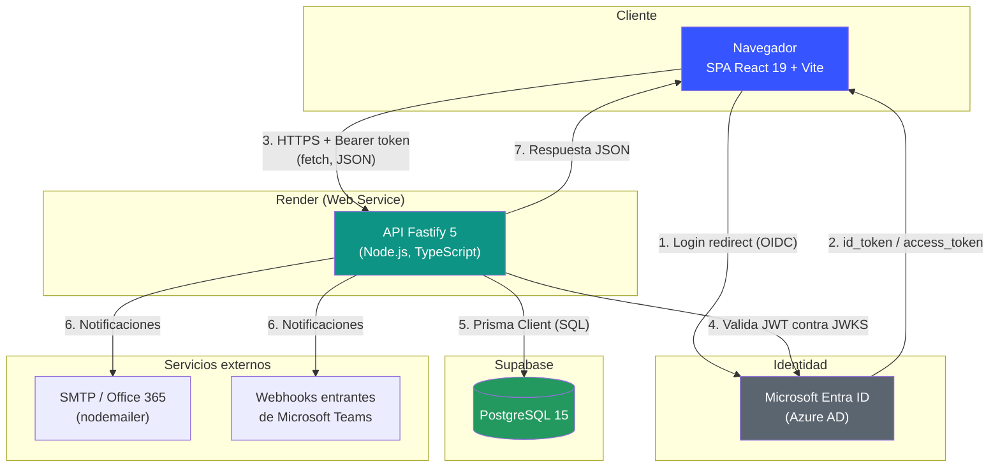
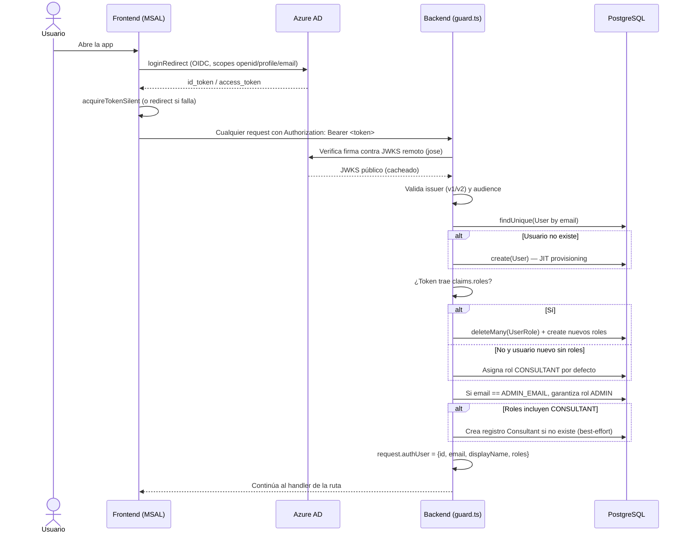
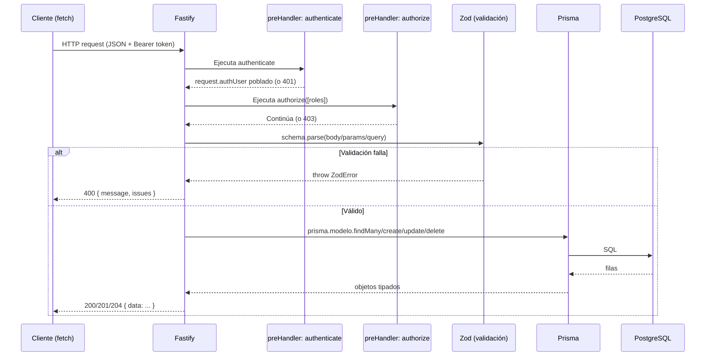
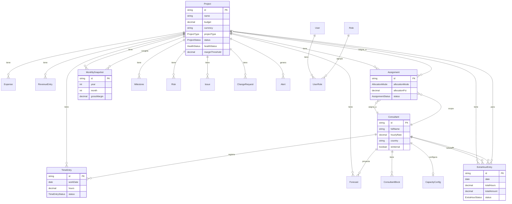
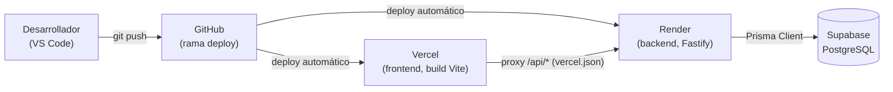
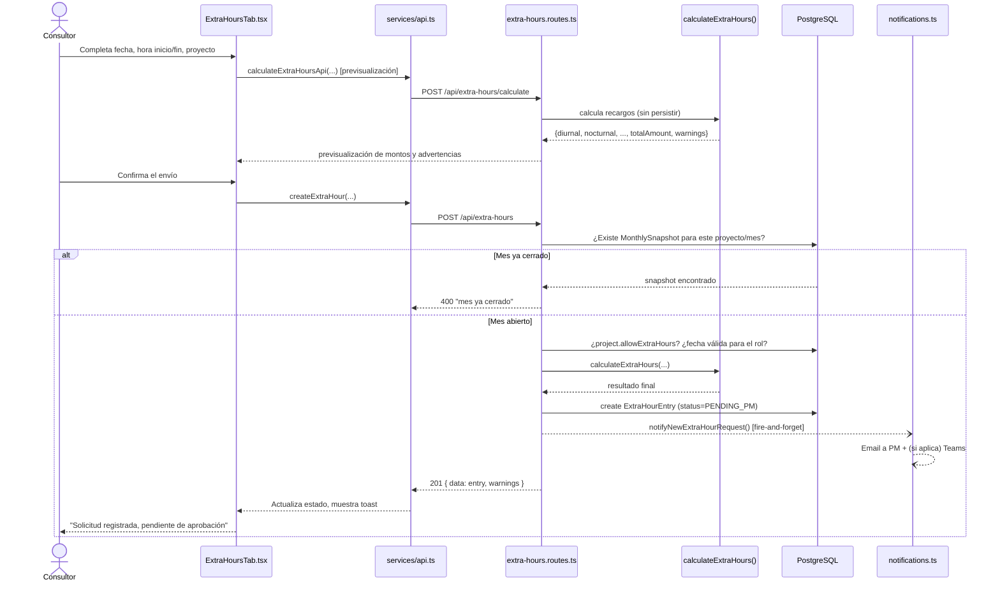
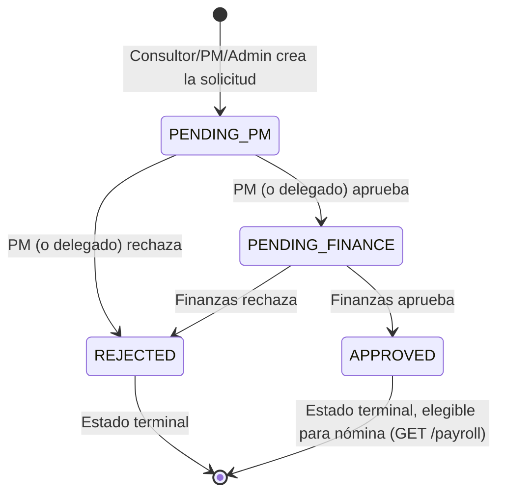

# Documentación Técnica de Arquitectura — Synatrack

> **Audiencia**: desarrolladores que se incorporan al proyecto.
> **Objetivo**: que cualquier desarrollador pueda entender el sistema completo y continuar su desarrollo sin depender de explicaciones adicionales.
> **Última actualización**: 2026-07-27.
> Este documento complementa (no reemplaza) a [`DOCUMENTACION_APLICACION.md`](DOCUMENTACION_APLICACION.md) (funcional), [`DOCUMENTACION_CORREOS.md`](DOCUMENTACION_CORREOS.md) (notificaciones), [`VISTAS.md`](VISTAS.md) (vistas de negocio), [`ARQUITECTURA.md`](ARQUITECTURA.md) (versión sencilla) y [`DEPLOYMENT.md`](DEPLOYMENT.md) (guía operativa de despliegue). Aquí se documenta la arquitectura técnica en profundidad.

---

## Índice

1. [Resumen Ejecutivo](#1-resumen-ejecutivo)
2. [Arquitectura General](#2-arquitectura-general)
3. [Backend](#3-backend)
4. [Frontend](#4-frontend)
5. [Comunicación Frontend-Backend](#5-comunicación-frontend-backend)
6. [Despliegue](#6-despliegue)
7. [Configuración del Proyecto](#7-configuración-del-proyecto)
8. [Flujo completo de una funcionalidad: Horas Extra](#8-flujo-completo-de-una-funcionalidad-horas-extra)
9. [Guía para continuar el desarrollo](#9-guía-para-continuar-el-desarrollo)
10. [Puntos críticos del proyecto](#10-puntos-críticos-del-proyecto)
11. [Mejoras recomendadas](#11-mejoras-recomendadas)

---

## 1. Resumen Ejecutivo

### 1.1 Objetivo de la aplicación

Synatrack es un sistema interno de **gestión de consultoría y proyectos** para Synaptica. Centraliza el control de horas trabajadas, la capacidad/disponibilidad de consultores, el presupuesto y avance financiero de proyectos (EVM), el cálculo de horas extra conforme a la legislación laboral de varios países latinoamericanos, y la generación automática de alertas de riesgo.

### 1.2 Problema que resuelve

El insumo en [`contexto/`](contexto/) (plantilla `Plantilla_Monitoreo_Presupuesto_TI_Completa2.xlsx`, documento de requerimientos y transcripción de conversación con el cliente) evidencia que el proceso previo era manual, basado en hojas de cálculo. Synatrack reemplaza ese proceso con:

- Un registro único y auditable de horas, gastos e ingresos por proyecto.
- Cálculo automático de indicadores financieros (EVM, márgenes, salud del proyecto) que antes se calculaban a mano.
- Un motor de reglas de horas extra multi-país (Colombia, Perú, Chile, México, Ecuador, Argentina, España) con flujo de aprobación dual (PM → Finanzas), evitando cálculos manuales de nómina propensos a error.
- Alertas proactivas (presupuesto, margen, cronograma) en vez de detección reactiva de problemas.
- Control de acceso por rol integrado con la identidad corporativa (Microsoft Entra ID).

### 1.3 Flujo general del sistema

```
Usuario → Login (Azure AD o modo demo) → SPA de React →
API REST (Fastify, valida y autoriza) → PostgreSQL (vía Prisma) →
cálculos de dominio (EVM, capacidad, recargos, conversión de moneda) →
respuesta JSON → actualización de la interfaz
```

No hay colas de mensajes, cache intermedio (Redis) ni un *API Gateway* separado: es un monolito modular de dos piezas (SPA + API) que hablan HTTP directo, con dos procesos de mantenimiento que solo corren **una vez, al arrancar el backend** (ver [§2.6](#26-servicios-externos) y [§10](#10-puntos-críticos-del-proyecto)).

### 1.4 Tecnologías utilizadas

| Capa | Tecnología |
|---|---|
| Frontend | React 19, TypeScript, Vite 8 |
| Backend | Node.js 20/24 (ver inconsistencia en [§10](#10-puntos-críticos-del-proyecto)), Fastify 5, TypeScript |
| ORM / Base de datos | Prisma 6 sobre PostgreSQL 15 (Supabase en producción) |
| Validación | Zod 4 (frontend implícito vía errores del backend; backend explícito en cada ruta) |
| Autenticación | Microsoft Entra ID (Azure AD) vía `jose` (backend) y `@azure/msal-browser`/`@azure/msal-react` (frontend) |
| Notificaciones | `nodemailer` (SMTP/Office 365) + webhooks entrantes de Microsoft Teams |
| Exportación | `jspdf`/`jspdf-autotable` (PDF), `xlsx` (Excel), CSV propio |
| Testing | Vitest + Testing Library (frontend), Vitest (backend) |
| Hosting | Vercel (frontend), Render (backend), Supabase (base de datos) |

### 1.5 Arquitectura general

Cliente-servidor clásica: **SPA** (Single Page Application, sin router de terceros) que consume una **API REST** propia, organizada como monolito modular por dominio de negocio ("vertical slices"), con una única base de datos relacional. No existen microservicios, BFF, gateway ni mensajería asíncrona. El único "procesamiento en segundo plano" son dos rutinas (`runAssignmentMaintenance`, `runAlertEngine`) disparadas al arrancar el proceso del backend.

### 1.6 Principales características

- Gestión de proyectos estilo PMP (hitos, riesgos, issues, solicitudes de cambio, fases, línea base).
- Registro y aprobación de horas trabajadas y horas extra (con recargos automáticos por país).
- Capacidad/disponibilidad de consultores con detección de sobrecarga.
- Multi-moneda con conversión FX y snapshots mensuales inmutables para cierre financiero.
- EVM (CPI/SPI/EAC/VAC) y semáforo de salud (RAG) por proyecto.
- Motor de alertas automáticas (presupuesto, margen, CPI, vencimiento de asignaciones).
- Control de acceso basado en 5 roles con *JIT provisioning* desde Azure AD.
- Auditoría de cambios (parcial, ver [§10](#10-puntos-críticos-del-proyecto)).

---

## 2. Arquitectura General

### 2.1 Diagrama conceptual



### 2.2 Flujo de información: de la acción del usuario a la respuesta

1. El usuario interactúa con un componente de un **`*Tab.tsx`** en `frontend/src/features/`.
2. El componente llama a una función de un **hook de dominio** (`frontend/src/hooks/useX.ts`) o directamente a una función de **`frontend/src/services/api.ts`**.
3. `api.ts` arma la petición `fetch` (JSON, header `Authorization: Bearer <token>` si hay sesión), la envía a `VITE_API_URL` (o a `/api/*` si es Vercel, que la reescribe hacia Render).
4. En el backend, Fastify enruta la petición al módulo correspondiente en `backend/src/modules/*/*.routes.ts`.
5. Se ejecutan los `preHandler`: `authenticate` (resuelve/crea el usuario, valida el JWT o aplica bypass demo) y `authorize([...roles])` (verifica rol).
6. El handler valida el `body`/`params`/`query` con un esquema **Zod** definido en el mismo archivo.
7. El handler llama a **Prisma** directamente (no hay capa de repositorio) y, si aplica, a funciones puras de `backend/src/utils/*` (EVM, capacidad, moneda, recargos, salud).
8. Prisma traduce a SQL y consulta/escribe en PostgreSQL (Supabase).
9. El handler arma la respuesta (usualmente `{ data: ... }`) y la retorna; Fastify la serializa a JSON.
10. `api.ts` (frontend) parsea la respuesta; si `!response.ok`, lanza un `Error` con el mensaje (traducido al español si es un error de validación Zod).
11. El hook de dominio actualiza su estado (`useState`); React re-renderiza el `*Tab.tsx`, y el usuario ve el resultado (o un toast/banner de error vía `handleError` en `App.tsx`).

### 2.3 Comunicación Frontend – Backend – Base de datos

- Frontend y backend se comunican **únicamente por HTTP/JSON**, sin WebSockets, SSE ni GraphQL.
- El backend es el **único** que habla con la base de datos; el frontend nunca accede a Postgres directamente.
- No existe cache intermedio: cada request al backend dispara una o más consultas frescas a Postgres vía Prisma.

### 2.4 Flujo de autenticación

Ver diagrama detallado en [§5.4](#54-autenticación-y-autorización) y la explicación completa del *JIT provisioning* en [§3.3](#33-arquitectura-interna).

### 2.5 Flujo de manejo de errores

- **Backend**: un único `setErrorHandler` en [`backend/src/app.ts`](backend/src/app.ts). Si el error es un `ZodError` → `400` con `{ message: "Validation error", issues: [{path, message}] }`. Cualquier otro error → `500` con `{ message: "Internal server error", detail, stack }` — **el `stack` trace se envía siempre, sin importar el entorno** (no hay condicional por `NODE_ENV`; ver [§10](#10-puntos-críticos-del-proyecto)). Rutas no encontradas → `404 { message: "Route not found" }`.
- **Frontend**: `request()` en `services/api.ts` centraliza el manejo: si la respuesta no es "ok", intenta traducir errores de validación Zod al español (diccionario `FIELD_MAP` + `translateMessage`), o usa `errorBody.message` tal cual. El error se propaga como `throw`, y cada Tab lo captura y llama a `onError` (→ `handleError` en `App.tsx`), que muestra un banner persistente y un toast efímero.

### 2.6 Servicios externos

| Servicio | Uso | Notas |
|---|---|---|
| **Microsoft Entra ID (Azure AD)** | Autenticación corporativa (OIDC/JWT) | Validación contra JWKS remoto; puede desactivarse con `AUTH_DEMO_BYPASS=true` |
| **Supabase** | Hosting de PostgreSQL | Se usa solo como Postgres administrado; no se usan sus features de Auth/Storage/Realtime |
| **SMTP (Office 365)** | Envío de correos de notificación | Si no está configurado, cae en modo *mock* (`console.log`) |
| **Microsoft Teams (Incoming Webhooks)** | Notificaciones de nómina y feedback | Igual que SMTP, mockeado si no hay URL configurada |
| **Tasas de cambio (FX)** | — | **No se encontró ninguna integración automática** con un proveedor externo (ECB, Banrep, etc.). El campo `FxRateHistory.source` admite ese texto libre, pero la carga de tasas es manual vía `fx.routes.ts` / la vista "Tasas FX". Esto se documenta explícitamente porque no se debe asumir que las tasas se actualizan solas. |

No hay ningún *scheduler* (cron, `node-cron`, `setInterval`) en el repositorio: `runAssignmentMaintenance` y `runAlertEngine` se ejecutan **una sola vez**, al arrancar el proceso de Node (ver [`backend/src/server.ts`](backend/src/server.ts) y [§10](#10-puntos-críticos-del-proyecto)).

### 2.7 Flujo de carga de datos (frontend)

`App.tsx` instancia, una sola vez, un hook por dominio (`useProjects`, `useConsultants`, `useTimeEntries`, etc.), cada uno con la forma `{ data, loading, reload }`. Cada hook recibe un flag `enabled` derivado del permiso del usuario (`can("projects:read")`) y se auto-carga en un `useEffect` al montar. No hay cache compartida (ni React Query/SWR): cada `reload()` vuelve a traer el dataset completo desde cero, y los datos se pasan como props hacia los `*Tab.tsx` (prop drilling puro, sin Context).

---

## 3. Backend

### 3.1 Tecnologías

| Categoría | Detalle |
|---|---|
| Runtime | Node.js (`.nvmrc`/`render.yaml` fijan `20.19.0`; `package.json.engines` pide `24.x` — inconsistencia, ver [§10](#10-puntos-críticos-del-proyecto)) |
| Framework HTTP | **Fastify 5.8.4** |
| Lenguaje | TypeScript (ESM puro, `NodeNext`) |
| ORM | **Prisma 6.16.3** (`@prisma/client` + CLI `prisma`) |
| Validación | **Zod 4.3.6** |
| Auth JWT | **jose 6.2.2** (verificación JWKS remoto) |
| CORS | `@fastify/cors 11.2.0` |
| Correo | `nodemailer 9.0.1` |
| Config | `dotenv 17.4.1` |
| Testing | `vitest` + `@vitest/coverage-v8` |
| Dev runner | `tsx` (watch mode) |

### 3.2 Estructura de carpetas

| Carpeta | Para qué sirve | Interacción con las demás |
|---|---|---|
| [`backend/src/modules/`](backend/src/modules/) | Un subdirectorio por dominio de negocio (24 módulos); cada uno con su(s) `*.routes.ts` y, si aplica, `*.service.ts`/`*.job.ts` | Cada módulo importa `auth/guard.ts`, `infra/prisma.ts` y funciones de `utils/`; se registra en `routes/index.ts` |
| [`backend/src/routes/`](backend/src/routes/) | `index.ts` centraliza el registro de todos los módulos bajo sus prefijos `/api/...`; `health.routes.ts` expone `/health` sin prefijo | Es el único punto que conoce todos los módulos a la vez |
| [`backend/src/auth/`](backend/src/auth/) | `guard.ts` (autenticación/JIT provisioning) y `roles.ts` (permisos granulares por rol) | Usado como `preHandler` en prácticamente todas las rutas |
| [`backend/src/utils/`](backend/src/utils/) | Funciones puras de cálculo de dominio (EVM, capacidad, moneda, salud, festivos, horas extra, financiero) + auditoría + notificaciones | Consumidas por los módulos de rutas; no dependen de Fastify ni de Prisma directamente (excepto `audit.ts`, que recibe el cliente Prisma como parámetro) |
| [`backend/src/infra/`](backend/src/infra/) | `prisma.ts`: instancia única (`singleton` simple, sin `globalThis`) del `PrismaClient` | Importado por todos los módulos y utils que tocan BD |
| [`backend/src/config/`](backend/src/config/) | `env.ts`: valida `process.env` con Zod al arrancar; aborta el proceso si falta algo obligatorio | Importado por `guard.ts`, `app.ts`, `server.ts` |
| [`backend/src/types/`](backend/src/types/) | `fastify.d.ts`: extiende `FastifyRequest` con `authUser` | Permite `request.authUser!` tipado en cualquier ruta |
| [`backend/prisma/`](backend/prisma/) | `schema.prisma` (modelo de datos), `migrations/` (historial SQL), `seed.mjs` (datos mínimos) | Fuente de verdad del esquema; `prisma generate` produce el cliente que usa `infra/prisma.ts` |
| [`backend/scripts/`](backend/scripts/) | Scripts operativos: `bootstrap-admin.mjs`, `smoke.mjs` | Se ejecutan manualmente (`npm run bootstrap:admin`, etc.), no forman parte del server en runtime |

### 3.3 Arquitectura interna

**Patrón de diseño identificado**: el backend **no** implementa un patrón en capas clásico (no hay MVC, no hay Clean Architecture, no hay Repository Pattern). Sigue un patrón de **"módulo por ruta" / *Transaction Script***: cada archivo `*.routes.ts` concentra validación (Zod), autorización, acceso a datos (Prisma directo) y armado de la respuesta, todo en la misma función *handler*. Es deliberadamente plano, lo cual **reduce el "salto entre archivos"** para entender un endpoint (todo está en un solo lugar) a cambio de **repetir patrones de validación/manejo de errores** entre los ~24 módulos. A continuación el mapeo explícito de las capas clásicas que el usuario podría esperar, y qué las reemplaza aquí:

| Capa "clásica" | ¿Existe en Synatrack? | Qué la reemplaza |
|---|---|---|
| **Controllers** | No, como capa separada | Los propios *handlers* de Fastify dentro de cada `*.routes.ts` (`app.get("/", { preHandler }, async (request, reply) => {...})`) |
| **Services** | Solo parcialmente | Un único `*.service.ts` real (`alerts.service.ts`, el motor de alertas). El resto de la "lógica de servicio" vive como funciones puras en `utils/` (ver abajo) |
| **Models** | Implícitos | Los tipos generados por Prisma a partir de `schema.prisma` se usan directamente como modelo de dominio; no hay clases de dominio propias |
| **Repositories** | No existen | `prisma.<modelo>.findMany/create/update/delete` se llama directamente dentro de cada *handler* — no hay abstracción/interfaz intermedia |
| **DTOs** | Fusionados con la validación | Los esquemas Zod (`z.object({...})`) declarados al inicio de cada `*.routes.ts` cumplen el rol de DTO de entrada; no hay DTOs de salida — se devuelve el resultado de Prisma casi tal cual, envuelto en `{ data }` |
| **Middlewares** | Sí | `authenticate`/`authorize` (preHandlers de Fastify), el plugin `@fastify/cors`, el parser de body JSON tolerante a body vacío, el error handler global y el 404 handler — todos en `app.ts`/`auth/guard.ts` |
| **Helpers / Utilidades** | Sí, es donde vive la lógica de negocio real | `backend/src/utils/*.ts`: `evm.ts`, `financial.ts`, `capacity.ts`, `health.ts`, `holidays.ts`, `currency.ts`, `calculateExtraHours.ts`, `audit.ts`, `notifications.ts` |
| **Configuración** | Sí | `config/env.ts` (Zod), `infra/prisma.ts` |
| **Rutas** | Sí | `modules/*/*.routes.ts` + registrador central `routes/index.ts` |

**Flujo de autenticación (JIT Provisioning) — detallado**:



Puntos clave de este flujo (detalle exacto en [`backend/src/auth/guard.ts`](backend/src/auth/guard.ts)):
- En **modo demo** (`AUTH_ENABLED=false` o `AUTH_DEMO_BYPASS=true`), todo lo anterior se omite: se asigna directamente un usuario `local-admin` con rol `ADMIN`, sin tocar la base de datos ni validar ningún token.
- Los roles que trae el token de Azure AD **sobrescriben completamente** los roles locales en cada login (Azure AD es la fuente de verdad); el mapeo especial `"NOMINA" → "FINANCE"` permite usar un nombre de grupo distinto en Azure AD.
- El email configurado en `ADMIN_EMAIL` siempre recupera el rol `ADMIN`, sin importar lo que devuelva Azure AD — es una salvaguarda para no perder acceso administrativo.
- `authorize([roles])` es un chequeo de **rol crudo** (`AppRole[]`), no del sistema fino de `Permission` (`roles.ts`) — ese sistema de permisos granulares solo se expone al frontend vía `GET /api/auth/me` para decidir qué mostrar en la UI; **la protección real de cada endpoint es por rol**, no por permiso individual.

### 3.4 APIs

#### 3.4.1 Organización de endpoints

Todos los módulos se registran centralmente en [`backend/src/routes/index.ts`](backend/src/routes/index.ts) bajo el prefijo `/api/<recurso>`:

| Prefijo | Módulo | Prefijo | Módulo |
|---|---|---|---|
| `/health` | Health check (sin prefijo `/api`) | `/api/snapshots` | Cierre mensual |
| `/api/auth` | Login/perfil (`/me`) | `/api/alerts` | Motor de alertas |
| `/api/projects` | Proyectos + detalle + hitos + riesgos + issues + cambios | `/api/audit` | Bitácora de auditoría |
| `/api/consultants` | Consultores + bloqueos de agenda | `/api/extra-hours` | Horas extra + config + nómina |
| `/api/time-entries` | Registro de horas | `/api/estimations` | Calculadora de estimaciones |
| `/api/expenses` | Gastos | `/api/profile` | Perfil propio del usuario |
| `/api/forecasts` | Proyecciones | `/api/activities` | Actividades/tareas |
| `/api/stats` | KPIs consolidados (dashboard/portafolio) | `/api/custom-holidays` | Festivos personalizados |
| `/api/admin/users` | Gestión de usuarios | `/api/delegations` | Delegación de aprobaciones |
| `/api/fx` | Tasas de cambio | `/api/feedback` | Buzón de feedback |
| `/api/revenue` | Ingresos reconocidos | | |
| `/api/assignments` | Asignaciones consultor-proyecto | | |
| `/api/capacity` | Disponibilidad/ocupación | | |

#### 3.4.2 Flujo de una petición (genérico)



#### 3.4.3 Validaciones

100% con **Zod**, declaradas inline en cada archivo de rutas (no hay esquemas compartidos centralizados salvo casos puntuales). Patrones recurrentes: `z.coerce.date()` para fechas desde query/body, `z.string().length(3)` + `.transform(toUpperCase)` para códigos de moneda ISO, `z.string().regex(/^\d{2}:\d{2}(:\d{2})?$/)` para horas. Cuando `schema.parse()` falla, lanza un `ZodError` que captura el error handler global (no hay `try/catch` individual por ruta para validación).

#### 3.4.4 Respuesta

Convención uniforme (no formalizada con un tipo compartido, pero consistente en la práctica): `{ data: <resultado> }` para éxito, con código `200` (lectura/actualización), `201` (creación) o `204` sin cuerpo (borrado). Los listados no llevan paginación real en la mayoría de los módulos (traen todo con `findMany`); la excepción es `audit.routes.ts`, que sí pagina.

#### 3.4.5 Manejo de excepciones

Ningún módulo hace `try/catch` genérico — se apoyan en que Fastify propaga cualquier excepción al `setErrorHandler` global ([§2.5](#25-flujo-de-manejo-de-errores)). Las excepciones puntuales manejadas manualmente son errores de Prisma por restricciones de FK (`code === "P2003" || "P2014"` → `409 Conflict` con mensaje de negocio, patrón visible en `expenses.routes.ts` y otros módulos con `DELETE`).

### 3.5 Base de datos

#### 3.5.1 Modelo de datos (resumen por dominio)



*(Diagrama simplificado — el esquema completo tiene 27 modelos y 19 enums; ver [`backend/prisma/schema.prisma`](backend/prisma/schema.prisma) para el detalle exacto de cada campo.)*

**Entidades principales por dominio**:

- **Proyecto**: `Project` (núcleo), `Milestone`, `Risk`, `Issue`, `ChangeRequest`, `ApprovalDelegation`, `Estimation`.
- **Consultor / Capacidad**: `Consultant`, `ConsultantBlock`, `CapacityConfig`, `Assignment`, `Activity`.
- **Financiero**: `TimeEntry`, `Expense`, `Forecast`, `RevenueEntry`, `FxConfig`, `FxRateHistory`, `MonthlySnapshot`, `ExtraHoursConfig`, `ExtraHourEntry`.
- **Sistema/Auth**: `User`, `Role`, `UserRole`, `Alert`, `AuditLog`, `CustomHoliday`.

**Relaciones y reglas `onDelete` destacables**: `Assignment → Consultant` es `Restrict` (no se puede borrar un consultor con asignaciones); `MonthlySnapshot → Project` es `Cascade` (borrar un proyecto arrastra sus cierres mensuales — cambiado explícitamente en una migración, ver abajo); `TimeEntry/ExtraHourEntry → Consultant` es `Restrict`; `Activity → Project` es `SetNull`. Índice compuesto único clave: `MonthlySnapshot.@@unique([projectId, year, month])` — es la manera en que todo el sistema detecta "este mes ya está cerrado".

#### 3.5.2 Migraciones

| # | Migración | Qué introdujo |
|---|---|---|
| 1 | `20260529120000_init` | Esquema inicial: 18 enums + ~24 tablas núcleo (Project, Consultant, TimeEntry, Expense, Forecast, RevenueEntry, Fx*, User/Role/UserRole, Assignment, ConsultantBlock, CapacityConfig, MonthlySnapshot, Alert, AuditLog, Milestone, Risk, Issue, ChangeRequest) |
| 2 | `20260602151904_add_cascade_monthly_snapshot` | Cambia `MonthlySnapshot.projectId` de `ON DELETE RESTRICT` a `CASCADE` |
| 3 | `20260604214520_add_extrahours_and_estimations` | Enum `ExtraHourStatus`; tablas `ExtraHoursConfig`, `ExtraHourEntry`, `Estimation`; columnas `Project.allowExtraHours`, `Consultant.identification`, `User.bio/photoUrl/phrase` |
| 4 | `20260605151148_add_user_skills` | Columna `User.skills TEXT[]` |
| 5 | `20260605160845_add_activities_model` | Tabla `Activity` |

> **⚠️ Drift de esquema detectado**: comparando `schema.prisma` contra las 5 migraciones anteriores, los siguientes elementos **no tienen migración asociada**: el modelo `CustomHoliday`, el modelo `ApprovalDelegation`, los campos `Consultant.allowWeekendWork`/`Consultant.isInternal`, `ExtraHoursConfig.monthlyDivisor` y `User.country`. Esto indica que se aplicaron con `prisma db push` (existe el script `npm run prisma:push`) en lugar de generar una migración versionada. **Consecuencia práctica**: una base de datos nueva creada solo con `prisma migrate deploy` (el comando que usa el flujo de producción documentado) **no tendrá estas tablas/columnas**, y la aplicación fallará en runtime al intentar usarlas. Ver [§10](#10-puntos-críticos-del-proyecto).

#### 3.5.3 Seeders

[`backend/prisma/seed.mjs`](backend/prisma/seed.mjs) (`npm run prisma:seed`) es intencionalmente mínimo: crea los 5 roles del catálogo (`Object.values(AppRole)`) y un único usuario `ADMIN` (`ADMIN_EMAIL` o `admin@synaptica.local`). **No siembra** proyectos, consultores ni registros de ejemplo — el ambiente queda "vacío pero utilizable". Existe además [`backend/scripts/bootstrap-admin.mjs`](backend/scripts/bootstrap-admin.mjs), funcionalmente equivalente, pensado para correr contra una base ya migrada en cualquier momento (no solo en el seed inicial).

---

## 4. Frontend

### 4.1 Tecnologías

| Categoría | Detalle |
|---|---|
| Librería UI | **React 19.2.4** |
| Build tool | **Vite 8.0.4** (+ `@vitejs/plugin-react`) |
| Lenguaje | TypeScript (proyecto dual `tsconfig.app.json`/`tsconfig.node.json`) |
| Router | **Ninguno** — no hay `react-router-dom` ni similar (confirmado por ausencia en `package.json` y grep global) |
| Gestión de estado | Hooks locales de React (`useState`/`useEffect`/`useMemo`/`useCallback`) + *prop drilling*; **sin** Context API, Redux, Zustand, Jotai ni Recoil |
| Cliente HTTP | `fetch` nativo envuelto en una función propia (`services/api.ts`); **sin** axios |
| UI Framework | Ninguna librería de componentes (no Material UI, no Chakra, no Tailwind) — CSS propio |
| Formularios | Sin librería (no Formik/React Hook Form) — formularios controlados manualmente con `useState` |
| Autenticación | `@azure/msal-browser` + `@azure/msal-react` |
| Exportación | `jspdf`/`jspdf-autotable` (PDF), `xlsx` (Excel), utilidad CSV propia |
| Testing | Vitest + Testing Library + `jsdom` |

### 4.2 Estructura del proyecto

| Carpeta/archivo | Para qué sirve |
|---|---|
| [`frontend/src/App.tsx`](frontend/src/App.tsx) (1967 líneas) | Orquestador único: sesión MSAL, `bootstrap()`, sidebar, "routing" manual, atajos de teclado, render de cada Tab |
| [`frontend/src/main.tsx`](frontend/src/main.tsx) | Inicializa `msalInstance`, procesa el redirect de login, monta `<MsalProvider>` |
| [`frontend/src/auth/msal.ts`](frontend/src/auth/msal.ts) | Configuración de MSAL (`authority`, `scopes`, `redirectUri`, cache en `localStorage`) |
| [`frontend/src/config/env.ts`](frontend/src/config/env.ts) | Lectura de variables de entorno con fallback a `window.__APP_CONFIG__` (inyección en runtime) |
| [`frontend/src/services/api.ts`](frontend/src/services/api.ts) (1876 líneas) | Única capa de comunicación con el backend: ~112 funciones + manejo de token + traducción de errores |
| [`frontend/src/hooks/`](frontend/src/hooks/) | 13 hooks de dominio (`useProjects`, `useConsultants`, `useTimeEntries`, etc.), todos con la forma `{data, loading, reload}` |
| [`frontend/src/features/`](frontend/src/features/) | 17 carpetas, una por sección de negocio, cada una con su `*Tab.tsx` (y archivos auxiliares en las más grandes: `dashboard`, `extraHours`, `expenses`, `projects`) |
| [`frontend/src/components/`](frontend/src/components/) | 18 componentes compartidos (tablas, KPI cards, selects, date pickers, toasts, alerts panel, chat, etc.) |
| [`frontend/src/utils/`](frontend/src/utils/) | 7 utilidades puras (moneda, fechas, periodos, salud de proyecto, CSV, labels de estado, validación) |
| [`frontend/src/types.ts`](frontend/src/types.ts) | Único tipo verdaderamente global: `TabId` (18 valores) |
| [`frontend/src/test/`](frontend/src/test/) | 10 archivos de test + `setup.ts` |
| [`frontend/server.mjs`](frontend/server.mjs) | Servidor HTTP standalone para producción (ver [§4.3](#43-flujo-de-navegación) y [§6](#6-despliegue)) |

No existen carpetas `pages/`, `context/`, `layouts/`, `store/` ni `routes/` — su función la cumplen, respectivamente, `features/*Tab.tsx`, (nada, no hay Context), (nada, layout inline en `App.tsx`), (nada, estado local), y el mecanismo manual descrito abajo.

### 4.3 Flujo de navegación

**No hay router**. La navegación es un mecanismo manual construido sobre la History API del navegador:

- `TAB_PATH_MAP`/`PATH_TAB_MAP` (en `App.tsx`) mapean cada `TabId` ↔ una ruta (`dashboard ↔ "/dashboard"`, etc.).
- `goTo(path)` llama `window.history.pushState(...)` y actualiza `currentPath` en estado de React.
- Un listener de `popstate` sincroniza `activeTab` cuando el usuario usa atrás/adelante del navegador.
- Un `useEffect` sincroniza la URL cada vez que cambia `activeTab`.
- **Rutas protegidas**: un `useEffect` de guardia redirige a `/` si no hay sesión y la ruta pedida es una de las protegidas, o redirige a la pestaña activa si hay sesión y la ruta es pública (`/`, `/landing`, `/login`).
- **Deep-link / refresh directo**: como no hay servidor de rutas real, tanto `frontend/vercel.json` (`"source": "/(.*)", "destination": "/index.html"`) como `frontend/server.mjs` (fallback a `index.html` si el archivo no existe) devuelven siempre `index.html` para cualquier ruta — es la SPA la que decide, en el cliente, qué tab mostrar según `window.location.pathname`.

**Manejo de sesión**: `bootstrap()` en `App.tsx` decide entre 3 modos: (a) Microsoft real (`authWithMicrosoftEnabled`) — exige cuenta MSAL activa o redirige a `/`; (b) bypass local (`VITE_FORCE_LOCAL_AUTH=true`) — usa `sessionStorage.bypass_auth`; (c) llama siempre `getMe()` para poblar `authUser`/permisos una vez resuelto el modo. El login **siempre es redirect**, nunca popup (`loginRedirect`/`acquireTokenRedirect`).

### 4.4 Componentes

- **Reutilizables** (`components/`): agnósticos de dominio — `Table`, `KpiCard`, `SearchableSelect`, `CurrencyInput`, `DateRangePicker`, `StatusBadge`, `ConfirmDialog`, `Toast`, `ErrorBoundary`, `PageHeader`, `SectionLayout`, `EmptyState`, `AlertsPanel`, `RagChat`, etc.
- **Específicos** (`features/*/**Tab.tsx`): un componente grande por sección de negocio, que arma su propio formulario, tabla y lógica de filtrado, apoyándose en los componentes reutilizables.
- **Organización**: sin atomic design formal; es "componentes compartidos" vs. "componentes de feature", con algunas features grandes (`expenses`, `dashboard`) que además descomponen su Tab en sub-componentes y utilidades propias no compartidas (`gastosUtils.ts`, `useGastosGrouped.ts`, `dashboardUtils.ts`).
- **Comunicación entre componentes**: exclusivamente **props y callbacks** (`onError`, `onReload`, `onDrillTo`, etc.) — no hay eventos globales, Context ni pub-sub, con dos excepciones puntuales: `services/api.ts` guarda el token en una variable de módulo, y `hooks/useToast.ts` usa el mismo patrón para poder disparar toasts desde cualquier componente sin pasar la función por props.
- **Nota sobre el chat "IA"** (`RagChat.tsx`): es una simulación **enteramente del lado del cliente** — busca coincidencias de texto sobre los datos ya cargados (`projects`, `consultants`, `fxConfigs`, etc.) y responde con un `setTimeout` para simular latencia. **No llama a ningún backend/LLM real.**

### 4.5 Consumo del backend

- **Dónde está centralizado**: 100% en [`frontend/src/services/api.ts`](frontend/src/services/api.ts), función base `request<T>(path, method, body)`.
- **Manejo de tokens**: `setApiAccessToken(token)` guarda el token en una variable de módulo (closure); `App.tsx` la fija tras `getAccessToken()` (MSAL) y la limpia en logout. Se adjunta como `Authorization: Bearer <token>` en cada request si existe.
- **Manejo de errores**: si `!response.ok`, intenta parsear `{message, issues}`; si es un error de validación Zod del backend, lo traduce al español campo por campo (diccionario `FIELD_MAP`, ~30 entradas) antes de lanzar el `Error`.
- **Interceptores**: no existen en el sentido de axios; la función `request()` cumple ese rol de forma manual y centralizada (único punto de entrada/salida de todas las llamadas HTTP).

---

## 5. Comunicación Frontend – Backend

### 5.1 Cómo se comunican

HTTP/JSON puro sobre `fetch`. En desarrollo, el frontend llama directo a `VITE_API_URL` (`http://localhost:4000`). En producción (Vercel), `/api/*` se reescribe hacia el backend en Render (`frontend/vercel.json`); alternativamente, `VITE_API_URL` puede apuntar directo al backend.

### 5.2 Formato de las peticiones

- `Content-Type: application/json` siempre.
- `Authorization: Bearer <token>` si hay sesión (MSAL o, en modo demo, ausente).
- Body serializado con `JSON.stringify`, solo en `POST`/`PUT`/`PATCH`.

### 5.3 Formato de las respuestas

- Éxito: `{ data: <objeto o array> }`, con `200`/`201`, o `204` sin cuerpo.
- Error de validación: `400 { message: "Validation error", issues: [{ path, message }] }`.
- Error de negocio: `400`/`403`/`404`/`409` con `{ message: "<texto en español, orientado al usuario>" }`.
- Error no controlado: `500 { message, detail, stack }` (ver nota de seguridad en [§10](#10-puntos-críticos-del-proyecto)).

### 5.4 Autenticación y autorización

Ver el diagrama de secuencia completo en [§3.3](#33-arquitectura-interna). En resumen: el frontend obtiene un token de Microsoft (o ninguno, en modo demo) y lo reenvía tal cual en cada request; el backend lo valida contra el JWKS de Azure AD y resuelve rol(es) con *JIT provisioning*. La autorización es por **rol crudo** en cada endpoint (`authorize([AppRole.ADMIN, ...])`); el sistema de permisos finos (`roles.ts`) solo gobierna qué pestañas/botones se muestran en la UI, no qué puede hacer una petición HTTP directa.

### 5.5 Validaciones

Backend: Zod, exhaustivo, en cada endpoint de escritura. Frontend: prácticamente ninguna validación propia antes de enviar — se apoya en que el backend rechace y traduzca el error (patrón "server-authoritative validation").

### 5.6 Flujo completo, de la acción del usuario a la respuesta

Ver el flujo detallado con datos reales en la [§8](#8-flujo-completo-de-una-funcionalidad-horas-extra).

---

## 6. Despliegue

### 6.1 Entornos

| Entorno | Frontend | Backend | Base de datos |
|---|---|---|---|
| **Local (Docker)** | `frontend` container, puerto `4173` | `backend` container, puerto `4000` | `postgres:15-alpine`, puerto `5433→5432` |
| **Local (sin Docker)** | `npm run dev` (Vite), puerto `5173` | `npm run dev` (`tsx watch`), puerto `4000` | Postgres local o el mismo Supabase |
| **Producción** | **Vercel** | **Render** (Web Service, plan free) | **Supabase** (PostgreSQL administrado) |



### 6.2 `docker-compose.yml` (desarrollo local)

| Servicio | Imagen/Build | Puerto | Notas |
|---|---|---|---|
| `db` | `postgres:15-alpine` | `5433:5432` | Healthcheck `pg_isready`; volumen `pgdata` |
| `backend` | `./backend/Dockerfile` | `4000:4000` | `AUTH_DEMO_BYPASS=true`; corre `npx prisma migrate deploy && npm run start`; espera a que `db` esté `service_healthy` |
| `frontend` | `./frontend/Dockerfile` | `4173:4173` | `VITE_API_URL=http://localhost:4000`, `VITE_FORCE_LOCAL_AUTH=true` |

### 6.3 Backend en Render (`render.yaml`)

```yaml
type: web
runtime: node
plan: free
rootDir: backend
buildCommand: npm install --include=dev && npm run build
startCommand: npm run start
healthCheckPath: /health
```

Variables con `sync: false` (deben configurarse manualmente en el dashboard de Render, nunca en el repo): `CORS_ORIGIN`, `DATABASE_URL`, `DIRECT_URL`, `ADMIN_EMAIL`, `AZURE_AD_TENANT_ID`, `AZURE_AD_AUDIENCE`. Con valor fijo en el repo: `NODE_ENV=production`, `NODE_VERSION=20.19.0`, `AUTH_ENABLED=false`, `AUTH_DEMO_BYPASS=true` (⚠️ estos dos últimos vienen en modo demo por defecto — para producción real con Azure AD hay que cambiarlos manualmente).

> **Importante**: ni `buildCommand` ni `startCommand` ejecutan `prisma migrate deploy`. Las migraciones contra Supabase se aplican **manualmente** (`npm run prisma:deploy` desde la máquina del desarrollador), a diferencia de `docker-compose.yml`, que sí las aplica automáticamente al levantar el contenedor.

### 6.4 Frontend en Vercel

- Root directory: `frontend`. Install: `npm ci`. Build: `npm run build` (`tsc -b && vite build`). Output: `dist`.
- `frontend/vercel.json` reescribe `/api/*` hacia `https://app-gestion-demo.onrender.com/api/:path*` (URL de Render **hardcodeada** en el archivo, no una variable) y todo lo demás hacia `/index.html` (fallback SPA).

### 6.5 Variables de entorno

**Backend** (`backend/.env.example`, 20 variables):

| Variable | Propósito | Default de ejemplo |
|---|---|---|
| `PORT` | Puerto HTTP | `4000` |
| `NODE_ENV` | Entorno | `production` |
| `CORS_ORIGIN` | Orígenes permitidos (coma-separados o `*`) | — |
| `DATABASE_URL` | Cadena Postgres *pooled* (uso normal de la API) | Supabase pooler `:6543` |
| `DIRECT_URL` | Cadena Postgres directa (solo migraciones) | Supabase directo `:5432` |
| `AUTH_ENABLED` | Activa validación real de JWT | `false` |
| `AUTH_DEMO_BYPASS` | Salta login, usuario admin local | `true` |
| `ADMIN_EMAIL` | Email que siempre recupera rol ADMIN | — |
| `AZURE_AD_TENANT_ID` | Tenant de Entra ID | — |
| `AZURE_AD_AUDIENCE` | Audience esperada en el JWT | — |
| `SMTP_HOST`/`PORT`/`USER`/`PASS`/`FROM` | Envío de correo | Office 365 |
| `PAYROLL_EMAIL` / `SUPPORT_EMAIL` | Destinatarios de notificaciones | — |
| `TEAMS_PAYROLL_WEBHOOK_URL` / `TEAMS_FEEDBACK_WEBHOOK_URL` | Webhooks de Teams | — |

**Frontend** (`frontend/.env.example`, 6 variables): `VITE_API_URL`, `VITE_FORCE_LOCAL_AUTH`, `VITE_AZURE_TENANT_ID`, `VITE_AZURE_CLIENT_ID`, `VITE_AZURE_REDIRECT_URI`, `VITE_AZURE_API_SCOPE`. En producción estas mismas variables pueden inyectarse **en runtime** (sin rebuild) vía `frontend/server.mjs`, que expone `/env.js` generando `window.__APP_CONFIG__` a partir de variables de entorno del proceso (con varios alias aceptados, p. ej. `AZURE_TENANT_ID`/`ENTRA_TENANT_ID`/`AAD_TENANT_ID` para `VITE_AZURE_TENANT_ID`).

### 6.6 Cómo realizar un nuevo despliegue

1. Trabajar y probar en `develop`.
2. `git checkout deploy && git merge develop && git push origin deploy` (Render y Vercel despliegan automáticamente al detectar el push, vía sus integraciones nativas con GitHub).
3. Si hubo cambios de esquema: correr manualmente `npm run prisma:deploy` (desde `backend/`, contra la `DATABASE_URL`/`DIRECT_URL` de producción) — **no ocurre automáticamente**.
4. Validar: `GET /health` del backend (`ok`, `database: "up"`), abrir el frontend, revisar consola por errores CORS, probar login y un CRUD básico, y opcionalmente correr `npm run smoke` contra la URL de Render.

### 6.7 Cómo configurar un nuevo entorno

1. Crear proyecto en Supabase → copiar cadena *pooled* (`DATABASE_URL`) y directa (`DIRECT_URL`, con `sslmode=require`).
2. `cd backend && npm ci && npm run prisma:generate && npm run prisma:deploy` (y opcionalmente `npm run prisma:push` para aplicar los elementos con drift mencionados en [§3.5.2](#352-migraciones), y `npm run prisma:seed`).
3. Configurar el Web Service en Render (ver [§6.3](#63-backend-en-render-renderyaml)) con todas las variables `sync: false`.
4. Configurar el proyecto en Vercel (ver [§6.4](#64-frontend-en-vercel)) con las 6 variables de `frontend/.env.example`.
5. Si se usará login real (no demo): registrar la app en Microsoft Entra ID, configurar `AZURE_AD_TENANT_ID`/`AZURE_AD_AUDIENCE` en el backend y `VITE_AZURE_*` en el frontend (mismo tenant/app registration en ambos lados), y cambiar `AUTH_ENABLED=true`, `AUTH_DEMO_BYPASS=false`.
6. Actualizar `CORS_ORIGIN` en Render con la URL final de Vercel.

### 6.8 Scripts operativos

| Script | Comando | Uso |
|---|---|---|
| `backend/scripts/bootstrap-admin.mjs` | `npm run bootstrap:admin` | Garantiza/crea el usuario ADMIN inicial en una BD ya migrada |
| `backend/scripts/smoke.mjs` | `npm run smoke` | Smoke test E2E contra una API viva (health → CRUD básico → stats) |

### 6.9 CI/CD

**No existe** ningún workflow de GitHub Actions (no hay carpeta `.github/`). El "CI/CD" actual es 100% las integraciones nativas de Render/Vercel escuchando pushes a la rama `deploy` — no hay tests automáticos ni type-check obligatorio antes de desplegar.

---

## 7. Configuración del Proyecto

*(Las tablas de variables de entorno están en [§6.5](#65-variables-de-entorno); aquí se documenta configuración de build/lint/test.)*

### 7.1 TypeScript

| Archivo | `target` | `module`/resolution | Notas |
|---|---|---|---|
| `backend/tsconfig.json` | `ES2022` | `NodeNext`/`NodeNext` | `strict: true`; `outDir: dist`, `rootDir: src` |
| `frontend/tsconfig.json` | — | — | Solo *project references* a los dos siguientes |
| `frontend/tsconfig.app.json` | `es2023` | `esnext`/`bundler` | `jsx: react-jsx`, `noEmit: true`; **no declara `strict` explícitamente**; `noUnusedLocals`/`noUnusedParameters` activos |
| `frontend/tsconfig.node.json` | `es2023` | `esnext`/`bundler` | Config del propio `vite.config.ts` |

### 7.2 Build

- **Backend**: `npm run build` = `prisma generate && tsc -p tsconfig.json` → `dist/`. `npm start` = `node dist/server.js`.
- **Frontend**: `npm run build` = `tsc -b && vite build` → `dist/`. Vite separa *vendor chunks* (`jspdf`, `xlsx`, `html2canvas`) vía `manualChunks` en `vite.config.ts`.

### 7.3 Servidor de producción del frontend

`frontend/server.mjs` (usado por `npm start`, para despliegues tipo Docker/Render, distinto del hosting real en Vercel): sirve `dist/` estático con verificación anti path-traversal, expone `/env.js` para inyectar configuración en runtime, hace fallback SPA a `index.html`, y escucha en `0.0.0.0:${PORT || 4173}`.

### 7.4 Lint y testing

- **Lint**: ESLint flat config (`eslint.config.js` implícito por los scripts), con `eslint-plugin-react-hooks`/`eslint-plugin-react-refresh`. Solo en frontend (`npm run lint`); no se encontró configuración de ESLint en backend.
- **Testing**: `vitest` en ambos proyectos. Frontend usa `jsdom` + Testing Library, configurado dentro de `frontend/vite.config.ts` (no hay `vitest.config.ts` separado). Backend usa Vitest puro sobre las funciones de `utils/`.

### 7.5 Dependencias clave a vigilar

`prisma`/`@prisma/client` deben mantenerse siempre en la misma versión entre sí (`6.16.3`). `jose` es crítica para la seguridad de la validación de JWT — cualquier actualización mayor debe revisarse contra los issuers/JWKS de Azure AD. `@azure/msal-browser`/`@azure/msal-react` deben mantenerse alineadas entre sí (mismas versiones mayor/minor).

---

## 8. Flujo completo de una funcionalidad: Horas Extra

Se eligió **Horas Extra** porque es el flujo que más capas del sistema atraviesa: cálculo de dominio multi-país, aprobación en dos niveles, notificaciones externas, y bloqueo por cierre financiero.

### 8.1 Diagrama de secuencia: registro de una solicitud



### 8.2 Máquina de estados de aprobación



### 8.3 Paso a paso completo (Usuario → … → Usuario)

1. **Usuario** (consultor) abre la pestaña "Horas Extra" y llena el formulario en `ExtraHoursTab.tsx`.
2. **Frontend** llama `calculateExtraHoursApi()` para previsualizar el monto en vivo mientras el usuario edita.
3. **API** (`POST /api/extra-hours/calculate`) ejecuta `ensureDefaultConfigs()` (auto-repara configuración de país si faltara) y corre el motor `calculateExtraHours()`, que:
   - Determina el país del consultor y su configuración de recargos (`ExtraHoursConfig`).
   - Calcula el divisor mensual (con la regla especial de Colombia: 210 desde el 2026-07-15 por la Ley 2101).
   - Simula minuto a minuto el turno, clasificando cada minuto según las reglas específicas del país (Colombia/Chile/Default: diurno/nocturno × feriado; Perú: franja nocturna fija + acumulado 120min; México: bolsa semanal 540min + feriados a 3.0x; Ecuador: suplementarias vs. extraordinarias).
   - Devuelve montos por franja + advertencias (p. ej. límite legal diario/semanal superado).
4. **Usuario** confirma el envío.
5. **Frontend** llama `createExtraHour()` → `POST /api/extra-hours`.
6. **Backend**: valida que el mes/proyecto no tenga ya un `MonthlySnapshot` (mes cerrado bloquea la creación), que el proyecto permita horas extra (`allowExtraHours`), y que la fecha sea válida para el rol de quien registra (un consultor no puede registrar fechas pasadas; PM/Admin sí).
7. **Backend** vuelve a ejecutar `calculateExtraHours()` (cálculo definitivo) y crea el `ExtraHourEntry` con `status: PENDING_PM`.
8. **Backend** dispara `notifyNewExtraHourRequest()` de forma *fire-and-forget* (un fallo de correo no rompe la respuesta al usuario) — email al PM del proyecto.
9. **Backend** responde `201 { data: entry, warnings }`.
10. **Frontend** actualiza el estado local (`reload()` del hook o actualización optimista) y muestra un toast de éxito.
11. **Usuario** (PM) ve la solicitud en su listado (`GET /api/extra-hours`, filtrado a "las suyas o de sus proyectos") y la aprueba (`PATCH /:id/approve`) — el backend valida que sea el PM del proyecto, el Admin, o alguien con una `ApprovalDelegation` activa; pasa a `PENDING_FINANCE` y notifica a Nómina/Teams.
12. **Usuario** (Finanzas) aprueba el nivel final (`PATCH /:id/approve` de nuevo, misma ruta pero rama distinta por estado) → pasa a `APPROVED`, se registran `approvedAt`/`approvedBy`, y se notifica por correo al consultor.
13. La entrada `APPROVED` queda disponible en `GET /api/extra-hours/payroll` (consolidado mensual, convertido a USD vía `FxConfig`) para que Finanzas procese el pago.

---

## 9. Guía para continuar el desarrollo

### 9.1 Agregar un nuevo módulo/entidad de negocio completo

1. **Modelo**: agregar a [`backend/prisma/schema.prisma`](backend/prisma/schema.prisma) y correr `npx prisma migrate dev --name <nombre>` (dentro de `backend/`) — **no** usar `prisma db push` para no repetir el drift descrito en [§3.5.2](#352-migraciones).
2. **Backend — rutas**: crear `backend/src/modules/<dominio>/<dominio>.routes.ts` siguiendo el patrón de `expenses.routes.ts` (Zod schema → `authenticate`/`authorize` → Prisma directo → `{ data }`).
3. **Backend — registrar**: importar y `app.register(...)` en [`backend/src/routes/index.ts`](backend/src/routes/index.ts) con su prefijo `/api/<recurso>`.
4. **Backend — permisos**: si necesita permisos nuevos, añadirlos al tipo `Permission` y a `rolePermissions` en [`backend/src/auth/roles.ts`](backend/src/auth/roles.ts).
5. **Backend — auditoría** (opcional pero recomendado dado el estado actual, ver [§10](#10-puntos-críticos-del-proyecto)): llamar `writeAudit(...)` (de `utils/audit.ts`) en creación/edición/borrado.
6. **Frontend — tipos y API**: agregar el tipo de dominio y las funciones `list*/create*/update*/delete*` en [`frontend/src/services/api.ts`](frontend/src/services/api.ts).
7. **Frontend — hook**: crear `frontend/src/hooks/use<Dominio>.ts` siguiendo el patrón `{data, loading, reload}` de `useProjects.ts`.
8. **Frontend — vista**: crear `frontend/src/features/<dominio>/<Dominio>Tab.tsx`.
9. **Frontend — registrar el tab**: añadir el valor a `TabId` en [`frontend/src/types.ts`](frontend/src/types.ts), una entrada en `TAB_PATH_MAP` y en el `SIDEBAR_GROUPS` correspondiente (con su `permission`), y el bloque de render condicional en `App.tsx`.
10. **Documentar**: añadir la vista a [`VISTAS.md`](VISTAS.md).

### 9.2 Agregar solo una pantalla nueva (sin entidad nueva, ej. un sub-reporte)

Repetir únicamente los pasos 8–9 de arriba, reutilizando datos ya expuestos por hooks/endpoints existentes.

### 9.3 Agregar un endpoint nuevo a un módulo existente

Editar directamente el `*.routes.ts` correspondiente: agregar el schema Zod si el payload es nuevo, el handler con su `preHandler` de auth, y (si corresponde) la función equivalente en `frontend/src/services/api.ts`.

### 9.4 Agregar una tabla nueva

Igual que el paso 1 de [§9.1](#91-agregar-un-nuevo-móduloentidad-de-negocio-completo) — siempre vía `prisma migrate dev`, nunca `db push`, para mantener el historial de migraciones consistente con el esquema real.

### 9.5 Agregar un "servicio" (lógica de negocio nueva)

- Si es un **cálculo puro** (fórmula, conversión, validación de reglas): nuevo archivo en `backend/src/utils/`, con su test en `backend/src/utils/__tests__/` (siguiendo `evm.test.ts`/`financial.test.ts` como referencia).
- Si es un **proceso que corre solo/reacciona a eventos del sistema** (como el motor de alertas): un nuevo `*.service.ts` dentro de su módulo, siguiendo `alerts.service.ts`. **Importante**: recordar que hoy no existe scheduler — si el nuevo proceso necesita correr periódicamente, hay que decidir e implementar explícitamente un mecanismo (ver recomendación en [§11](#11-mejoras-recomendadas)), no asumir que correrá solo por analogía con `alerts.service.ts`.

### 9.6 Agregar un componente nuevo

- Si es reutilizable entre features → `frontend/src/components/`.
- Si es específico de una sección → junto al `*Tab.tsx` correspondiente dentro de `frontend/src/features/<dominio>/`.
- Comunicación siempre por props/callbacks — no introducir Context ni una librería de estado global solo para un componente nuevo, salvo que se aborde la refactorización descrita en [§11](#11-mejoras-recomendadas).

### 9.7 Checklist para no romper el patrón existente

- [ ] ¿El endpoint nuevo valida con Zod antes de tocar Prisma?
- [ ] ¿Tiene `preHandler: [authenticate, authorize([...])]` con los roles correctos?
- [ ] ¿Devuelve `{ data: ... }` (o `204` sin cuerpo para deletes)?
- [ ] ¿Si escribe datos financieros/horas, respeta el candado de `MonthlySnapshot` como lo hacen `time-entries` y `extra-hours`?
- [ ] ¿Se agregó la función correspondiente en `services/api.ts` con el naming (`list*/get*/create*/update*/delete*`)?
- [ ] ¿El hook nuevo respeta la forma `{data, loading, reload}` y recibe un flag `enabled` atado a un permiso?

---

## 10. Puntos críticos del proyecto

Hallazgos verificados directamente contra el código (no son suposiciones), ordenados por severidad práctica.

### 10.1 Severidad alta

| # | Punto crítico | Evidencia |
|---|---|---|
| 1 | **El error handler global expone `stack` trace y mensaje de error crudo en cualquier entorno**, incluida producción — no hay condicional por `NODE_ENV`. | [`backend/src/app.ts:66`](backend/src/app.ts) |
| 2 | **Drift de esquema**: `CustomHoliday`, `ApprovalDelegation`, `Consultant.allowWeekendWork/isInternal`, `ExtraHoursConfig.monthlyDivisor`, `User.country` no tienen migración — una BD nueva creada solo con `prisma migrate deploy` quedará incompleta y la app fallará en runtime. | Comparación `schema.prisma` vs. `backend/prisma/migrations/` |
| 3 | **No hay ningún scheduler**: `runAssignmentMaintenance` (sincroniza estados de asignación) y `runAlertEngine` (motor de alertas) corren **una sola vez, al arrancar el proceso**. En Render (plan free, con cold starts/reinicios poco frecuentes), esto significa que las alertas y los cambios de estado de asignación pueden quedar desactualizados por días si el proceso no se reinicia. | [`backend/src/server.ts:18-19`](backend/src/server.ts); confirmado sin `node-cron`/`setInterval` en todo el repo |
| 4 | **Bug de conversión de moneda en `GET /api/projects/:id/profitability`**: se reconstruye un `rateMap` partiendo la clave con `key.split("_")`, pero `buildRateMap` genera las claves con el separador `"->"` — la reconstrucción nunca separa nada, y las conversiones de moneda en ese endpoint caen silenciosamente al *fallback* sin convertir. | [`backend/src/modules/projects/projects.routes.ts:281`](backend/src/modules/projects/projects.routes.ts) vs. [`backend/src/utils/currency.ts:52`](backend/src/utils/currency.ts) |
| 5 | **Autorización real por rol crudo, no por permiso**: el sistema granular de `Permission`/`resolvePermissions` (`roles.ts`) solo se usa para decidir qué mostrar en el frontend; cada endpoint protege con `authorize([AppRole...])` directamente. Cualquier cambio de "quién puede hacer qué" implica editar `authorize(...)` en cada ruta, no solo el mapa de permisos — riesgo de que UI y backend se desincronicen (un botón oculto en el frontend no implica que el endpoint esté protegido igual). | [`backend/src/auth/guard.ts`](backend/src/auth/guard.ts) (`authorize`) vs. [`backend/src/auth/roles.ts`](backend/src/auth/roles.ts) |

### 10.2 Severidad media

| # | Punto crítico | Evidencia |
|---|---|---|
| 6 | **Tres implementaciones no unificadas de "rentabilidad"/proyección financiera** (`calculateProfitability` en `financial.ts`, la lógica manual de `stats.routes.ts /overview`, la de `/portfolio`, y la de `project-detail.routes.ts`), con criterios distintos entre sí (p. ej. `/portfolio` no descuenta horas ya aprobadas del forecast, a diferencia de `/overview`). | `backend/src/utils/financial.ts`, `backend/src/modules/stats/stats.routes.ts`, `backend/src/modules/projects/project-detail.routes.ts` |
| 7 | **`marginThreshold` inconsistente**: `project-detail.routes.ts` usa el campo real `project.marginThreshold`; `stats.routes.ts` (ambos endpoints) y `alerts.service.ts` lo **hardcodean a `15`**, ignorando el valor configurado por proyecto. | `backend/src/modules/stats/stats.routes.ts`, `backend/src/modules/alerts/alerts.service.ts` |
| 8 | **`delayedMilestones` con criterios distintos**: `project-detail.routes.ts` usa `status === "DELAYED"` (un valor que hay que setear manualmente); `stats.routes.ts` lo deriva en memoria (`status !== "COMPLETED" && plannedDate < hoy`). Dos proyectos podrían mostrar salud distinta en el dashboard vs. el detalle. | Comparación de ambos archivos |
| 9 | **Auditoría incompleta**: `writeAudit` solo se llama desde 7 módulos (`assignments`, `delegations`, `forecasts`, `change-requests`, `snapshots`, `project-detail` solo en `/baseline`, `projects`). Horas, horas extra, gastos, ingresos, consultores, usuarios, capacidad, estimaciones, actividades y resolución de alertas **no dejan rastro** en `AuditLog`. | Grep de `writeAudit` sobre todo `backend/src` |
| 10 | **Nomenclatura inconsistente en `AuditLog.entity`**: `"Project"`/`"Forecast"` en mayúscula inicial mientras el resto usa camelCase (`"assignment"`, `"monthlySnapshot"`) — dificulta filtrar de forma consistente. | `backend/src/modules/projects/projects.routes.ts`, `forecasts.routes.ts` vs. el resto |
| 11 | **`GET /:id/detail` (project-detail) escribe en una petición de lectura**: si el `healthStatus` calculado difiere del guardado, la ruta hace `prisma.project.update(...)` dentro de un `GET`, sin auditar ese cambio. | `backend/src/modules/projects/project-detail.routes.ts` |
| 12 | **Estado `PARTIAL` de `Assignment` nunca se asigna en la práctica**: existe en el enum y se consulta en varios filtros (`capacity.ts`, `alerts.service.ts`), pero ningún flujo de escritura encontrado produce `status: "PARTIAL"`. | Grep de `"PARTIAL"` sobre `backend/src` |
| 13 | **`AlertType.CONSULTANT_OVERLOADED` nunca se genera**: está definido en el enum y en el tipo de `upsertAlert`, pero `runAlertEngine` no tiene ningún bloque que lo produzca. | `backend/src/modules/alerts/alerts.service.ts` |
| 14 | **`ASSIGNMENT_ENDING` nunca se resuelve automáticamente** (a diferencia de `BUDGET_*`/`MARGIN_*`/`FORECAST_DEVIATION`) — queda activa indefinidamente hasta que alguien la resuelva manualmente, incluso si la asignación ya se completó. | `backend/src/modules/alerts/alerts.service.ts` |
| 15 | **`assignments.job.ts` calcula "hoy" en hora local del servidor**, mientras el resto del backend (`capacity.ts`, `holidays.ts`, `financial.ts`) usa consistentemente `Date.UTC`. Si el servidor no corre en UTC, el corte de activación/completado de asignaciones puede desviarse un día del resto de los cálculos. | `backend/src/modules/assignments/assignments.job.ts` |
| 16 | **Cierre mensual sin validar que el mes haya terminado**: `POST /api/snapshots/close` no comprueba que el período a cerrar ya haya concluido — se puede cerrar el mes en curso o incluso meses futuros. | `backend/src/modules/snapshots/snapshots.routes.ts` |
| 17 | **`expenses`/`revenue` no respetan el cierre mensual**: a diferencia de horas y horas extra, se pueden seguir creando/editando/borrando gastos e ingresos de un proyecto después de cerrado el mes. | Grep de `monthlySnapshot` sobre `backend/src` |
| 18 | **Delegaciones de aprobación sin validación de solapamiento**: `POST /api/delegations` valida que `endDate >= startDate`, pero no impide crear delegaciones duplicadas o superpuestas para el mismo proyecto/aprobador. | `backend/src/modules/delegations/delegations.routes.ts` |
| 19 | **Conversión de nómina sin tasa disponible falla en silencio**: `GET /api/extra-hours/payroll`, si no encuentra un par `FxConfig` (directo o inverso) para convertir a USD, deja el monto igual al local **sin ninguna advertencia** — riesgo de que Finanzas procese un pago con el monto en la moneda equivocada sin darse cuenta. | `backend/src/modules/extra-hours/extra-hours.routes.ts` |
| 20 | **`computeHealthStatus` recibe `utilizationPct` pero nunca lo usa**; los tres llamadores siempre pasan `0` literal. Parámetro muerto que sugiere una regla de negocio planeada (salud por sobreutilización) que nunca se implementó. | `backend/src/utils/health.ts` |

### 10.3 Severidad baja / inconsistencias operativas

| # | Punto crítico | Evidencia |
|---|---|---|
| 21 | Versión de Node inconsistente: `.nvmrc`/`render.yaml`/Dockerfiles fijan `20.x`, pero `package.json` (ambos proyectos) declara `engines.node: "24.x"`. | `backend/.nvmrc`, `render.yaml`, `backend/package.json`, `frontend/package.json` |
| 22 | Comando de build de Render (`npm install --include=dev`) documentado distinto en `DEPLOYMENT.md` (`npm ci`) — pueden divergir en qué versiones exactas de dependencias se instalan. | `render.yaml` vs. `DEPLOYMENT.md` |
| 23 | `DEPLOYMENT.md` referencia `backend/.env.local.example`, `backend/.env.local.5433.example` y `backend/.env.production.example`, ninguno existe en el repo. | Verificado con `Test-Path` |
| 24 | La URL del backend en `frontend/vercel.json` está **hardcodeada** (`app-gestion-demo.onrender.com`) en vez de parametrizada — mover de servicio de Render rompe el rewrite silenciosamente. | `frontend/vercel.json` |
| 25 | No hay pipeline de CI: no se corren tests ni type-check automáticamente antes de desplegar; el único *smoke test* (`npm run smoke`) es manual y post-despliegue. | Ausencia de `.github/workflows/` |
| 26 | El chat "IA" (`RagChat.tsx`) es una simulación local por coincidencia de texto, no un LLM real — puede generar expectativas equivocadas en el usuario final si no se documenta como tal en la UI. | `frontend/src/components/RagChat.tsx` |
| 27 | `DIRECT_URL` (usada por Prisma para migraciones) no pasa por la validación Zod de `config/env.ts` — solo `DATABASE_URL` se valida; un `DIRECT_URL` mal configurado falla recién al correr una migración, no al arrancar el server. | `backend/src/config/env.ts` vs. `backend/prisma/schema.prisma` |

---

## 11. Mejoras recomendadas

### 11.1 Seguridad

- **No enviar `stack`/`detail` crudos al cliente en producción** (punto crítico #1): condicionar por `env.NODE_ENV === "production"` y loguear el detalle solo server-side (`app.log.error`).
- **Unificar autorización**: hacer que `authorize(...)` reciba permisos (`Permission[]`) en vez de roles crudos, resolviendo contra `rolePermissions` — así el mismo mapa gobierna UI y backend, eliminando el riesgo del punto #5.
- **Completar la auditoría** (punto #9): al menos para horas, horas extra, gastos y usuarios, dado que son los módulos con mayor impacto financiero/de nómina.

### 11.2 Escalabilidad y rendimiento

- **Reemplazar los jobs "al arrancar" por un scheduler real** (punto #3): `node-cron` (o un *cron job* nativo de Render) para que `runAssignmentMaintenance`/`runAlertEngine` corran periódicamente sin depender de reinicios del proceso.
- **Paginar listados grandes**: la mayoría de los `GET /` traen el dataset completo con `findMany` sin límite; a medida que crezcan `TimeEntry`/`ExtraHourEntry`/`AuditLog`, esto se volverá un cuello de botella. `audit.routes.ts` ya paginado puede servir de plantilla.
- **Cache de tasas FX** (`buildRateMap` se reconstruye en cada request que lo necesita): dado que las tasas cambian con poca frecuencia, se podría cachear en memoria con invalidación al escribir en `fx.routes.ts`.

### 11.3 Mantenibilidad y organización del código

- **Resolver el drift de migraciones** (punto #2): generar una migración formal que capture `CustomHoliday`, `ApprovalDelegation` y las columnas faltantes, y prohibir `prisma db push` como práctica normal (dejarlo solo para prototipado local).
- **Unificar el cálculo de rentabilidad/proyección** (punto #6) en una única función de `financial.ts`, consumida por `stats.routes.ts` y `project-detail.routes.ts`, en vez de mantener tres variantes.
- **Unificar `marginThreshold`** (punto #7) y el criterio de `delayedMilestones` (punto #8) en un solo lugar (idealmente dentro de `health.ts`, que ya es el punto de cómputo del semáforo).
- **Extraer un helper `getExtraHourAuthLevel(entry, user, project, delegations)`**: la lógica de "quién puede aprobar/rechazar en cada nivel" está duplicada entre `approve` y `reject` en `extra-hours.routes.ts`.
- **Considerar una capa fina de repositorio** para los modelos con más lógica repetida entre módulos (`Project`, `Consultant`) — no para todo el sistema (el patrón actual es válido para los CRUDs simples), sino donde el acceso a Prisma se repite con las mismas inclusiones/transformaciones en 3+ archivos.

### 11.4 Buenas prácticas / refactorizaciones puntuales

- Eliminar o implementar de verdad el parámetro `utilizationPct` de `computeHealthStatus` (punto #20).
- Decidir explícitamente el destino del estado `PARTIAL` (punto #12): implementarlo (p. ej. cuando la ocupación calculada por `capacity.ts` cae entre 1–99%) o retirarlo del enum si nunca fue necesario.
- Implementar `CONSULTANT_OVERLOADED` (punto #13) ya que `capacity.ts` ya calcula `OVERLOADED` como estado — conectar ambos es una victoria rápida.
- Agregar advertencia visible (no silenciosa) cuando `GET /payroll` no logra convertir un monto por falta de tasa FX (punto #19).
- Añadir validación de solapamiento de fechas en `delegations.routes.ts` (punto #18).
- Homologar `entity` en `AuditLog` a un único formato (recomendado: camelCase minúscula, como ya hace la mayoría) (punto #10).
- Alinear la versión de Node entre `.nvmrc`, Dockerfiles, `render.yaml` y `package.json.engines` (punto #21) para evitar comportamientos distintos entre entornos.
- Parametrizar la URL del backend en `frontend/vercel.json` (punto #24), o documentar explícitamente el paso manual de actualizarla si cambia el nombre del servicio en Render.

### 11.5 Sobre pruebas y CI

- Añadir un pipeline mínimo de GitHub Actions que corra `npm run build` + `npm test` (ambos proyectos) en cada PR hacia `develop`/`deploy`, dado que hoy nada bloquea un despliegue roto salvo la revisión manual.
- Ampliar la cobertura de tests del frontend más allá de utilidades puras: los `*Tab.tsx` grandes (`DashboardTab`, `ExtraHoursTab`, `ProjectDetailTab`) concentran la mayor parte de la lógica de UI y hoy no tienen tests propios.
