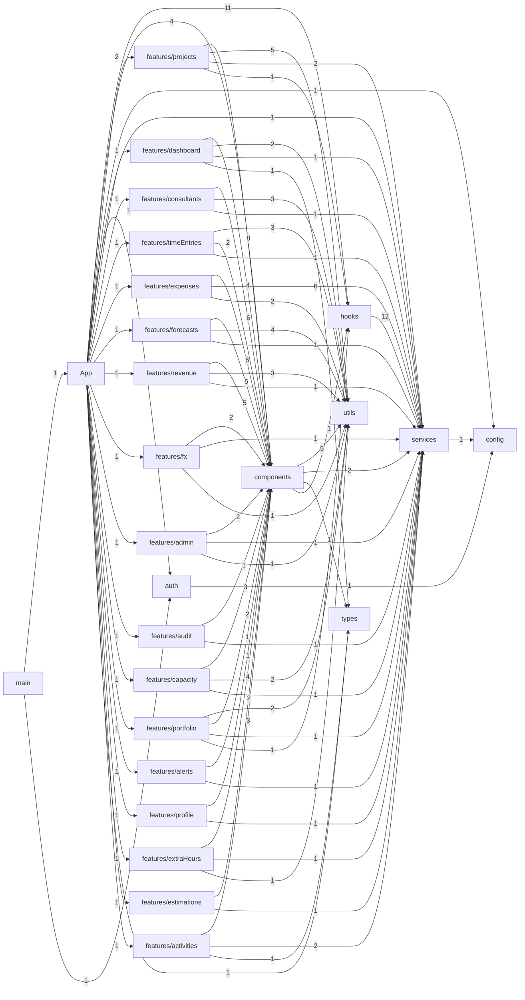

# Mapa del proyecto Synatrack

> **Archivo generado.** No lo edites a mano: corre `node scripts/generate-map.mjs`
> después de agregar rutas, pantallas o módulos.
> Generado el 2026-09-18.

Resumen: **125 endpoints**, **16 pantallas**,
**30 módulos de backend** y **26 de frontend**.

---

## 1. Endpoints del backend

Los roles salen del `authorize([...])` real de cada ruta, que es lo que de verdad
protege el endpoint (el mapa de `Permission` en `auth/roles.ts` solo gobierna la UI).

| Método | Ruta | Roles autorizados | Archivo |
|---|---|---|---|
| GET | `/` | PUBLICO | [backend/src/routes/health.routes.ts](backend/src/routes/health.routes.ts) |
| GET | `/api/activities` | ADMIN, PM, CONSULTANT, FINANCE, VIEWER | [backend/src/modules/activities/activities.routes.ts](backend/src/modules/activities/activities.routes.ts) |
| POST | `/api/activities` | ADMIN, PM, CONSULTANT | [backend/src/modules/activities/activities.routes.ts](backend/src/modules/activities/activities.routes.ts) |
| DELETE | `/api/activities/:id` | ADMIN, PM, CONSULTANT | [backend/src/modules/activities/activities.routes.ts](backend/src/modules/activities/activities.routes.ts) |
| PUT | `/api/activities/:id` | ADMIN, PM, CONSULTANT | [backend/src/modules/activities/activities.routes.ts](backend/src/modules/activities/activities.routes.ts) |
| GET | `/api/admin/users` | ADMIN | [backend/src/modules/admin/users.routes.ts](backend/src/modules/admin/users.routes.ts) |
| POST | `/api/admin/users` | ADMIN | [backend/src/modules/admin/users.routes.ts](backend/src/modules/admin/users.routes.ts) |
| PATCH | `/api/admin/users/:id` | ADMIN | [backend/src/modules/admin/users.routes.ts](backend/src/modules/admin/users.routes.ts) |
| GET | `/api/alerts` | ADMIN, PM, FINANCE, VIEWER | [backend/src/modules/alerts/alerts.routes.ts](backend/src/modules/alerts/alerts.routes.ts) |
| PATCH | `/api/alerts/:id/resolve` | ADMIN, PM, FINANCE | [backend/src/modules/alerts/alerts.routes.ts](backend/src/modules/alerts/alerts.routes.ts) |
| POST | `/api/alerts/run` | ADMIN | [backend/src/modules/alerts/alerts.routes.ts](backend/src/modules/alerts/alerts.routes.ts) |
| GET | `/api/alerts/unread-count` | ADMIN, PM, FINANCE, VIEWER | [backend/src/modules/alerts/alerts.routes.ts](backend/src/modules/alerts/alerts.routes.ts) |
| GET | `/api/assignments` | ADMIN, PM, FINANCE, VIEWER | [backend/src/modules/assignments/assignments.routes.ts](backend/src/modules/assignments/assignments.routes.ts) |
| POST | `/api/assignments` | ADMIN, PM | [backend/src/modules/assignments/assignments.routes.ts](backend/src/modules/assignments/assignments.routes.ts) |
| DELETE | `/api/assignments/:id` | ADMIN, PM | [backend/src/modules/assignments/assignments.routes.ts](backend/src/modules/assignments/assignments.routes.ts) |
| GET | `/api/assignments/:id` | ADMIN, PM, FINANCE, VIEWER | [backend/src/modules/assignments/assignments.routes.ts](backend/src/modules/assignments/assignments.routes.ts) |
| PUT | `/api/assignments/:id` | ADMIN, PM | [backend/src/modules/assignments/assignments.routes.ts](backend/src/modules/assignments/assignments.routes.ts) |
| PATCH | `/api/assignments/:id/cancel` | ADMIN, PM | [backend/src/modules/assignments/assignments.routes.ts](backend/src/modules/assignments/assignments.routes.ts) |
| PATCH | `/api/assignments/:id/complete` | ADMIN, PM | [backend/src/modules/assignments/assignments.routes.ts](backend/src/modules/assignments/assignments.routes.ts) |
| GET | `/api/audit` | ADMIN, FINANCE, PM | [backend/src/modules/audit/audit.routes.ts](backend/src/modules/audit/audit.routes.ts) |
| GET | `/api/auth/me` | (cualquier autenticado) | [backend/src/modules/auth/auth.routes.ts](backend/src/modules/auth/auth.routes.ts) |
| GET | `/api/capacity/available` | ADMIN, PM, FINANCE, VIEWER | [backend/src/modules/capacity/capacity.routes.ts](backend/src/modules/capacity/capacity.routes.ts) |
| GET | `/api/capacity/bench` | ADMIN, PM, FINANCE, VIEWER | [backend/src/modules/capacity/capacity.routes.ts](backend/src/modules/capacity/capacity.routes.ts) |
| GET | `/api/capacity/by-project` | ADMIN, PM, FINANCE, VIEWER | [backend/src/modules/capacity/capacity.routes.ts](backend/src/modules/capacity/capacity.routes.ts) |
| GET | `/api/capacity/consultant/:consultantId` | ADMIN, PM, FINANCE, VIEWER | [backend/src/modules/capacity/capacity.routes.ts](backend/src/modules/capacity/capacity.routes.ts) |
| GET | `/api/capacity/overloaded` | ADMIN, PM, FINANCE, VIEWER | [backend/src/modules/capacity/capacity.routes.ts](backend/src/modules/capacity/capacity.routes.ts) |
| GET | `/api/capacity/overview` | ADMIN, PM, FINANCE, VIEWER | [backend/src/modules/capacity/capacity.routes.ts](backend/src/modules/capacity/capacity.routes.ts) |
| GET | `/api/capacity/project/:projectId` | ADMIN, PM, FINANCE, VIEWER | [backend/src/modules/capacity/capacity.routes.ts](backend/src/modules/capacity/capacity.routes.ts) |
| GET | `/api/capacity/releasing` | ADMIN, PM, FINANCE, VIEWER | [backend/src/modules/capacity/capacity.routes.ts](backend/src/modules/capacity/capacity.routes.ts) |
| GET | `/api/consultants` | ADMIN, PM, CONSULTANT, FINANCE, VIEWER | [backend/src/modules/consultants/consultants.routes.ts](backend/src/modules/consultants/consultants.routes.ts) |
| POST | `/api/consultants` | ADMIN, PM | [backend/src/modules/consultants/consultants.routes.ts](backend/src/modules/consultants/consultants.routes.ts) |
| GET | `/api/consultants/:consultantId/blocks` | ADMIN, PM, FINANCE, VIEWER | [backend/src/modules/capacity/blocks.routes.ts](backend/src/modules/capacity/blocks.routes.ts) |
| POST | `/api/consultants/:consultantId/blocks` | ADMIN, PM | [backend/src/modules/capacity/blocks.routes.ts](backend/src/modules/capacity/blocks.routes.ts) |
| DELETE | `/api/consultants/:consultantId/blocks/:blockId` | ADMIN, PM | [backend/src/modules/capacity/blocks.routes.ts](backend/src/modules/capacity/blocks.routes.ts) |
| DELETE | `/api/consultants/:id` | ADMIN | [backend/src/modules/consultants/consultants.routes.ts](backend/src/modules/consultants/consultants.routes.ts) |
| PUT | `/api/consultants/:id` | ADMIN, PM | [backend/src/modules/consultants/consultants.routes.ts](backend/src/modules/consultants/consultants.routes.ts) |
| DELETE | `/api/consultants/by-name` | ADMIN | [backend/src/modules/consultants/consultants.routes.ts](backend/src/modules/consultants/consultants.routes.ts) |
| GET | `/api/custom-holidays` | ADMIN, PM, CONSULTANT, FINANCE, VIEWER | [backend/src/modules/holidays/custom-holidays.routes.ts](backend/src/modules/holidays/custom-holidays.routes.ts) |
| POST | `/api/custom-holidays` | ADMIN, PM | [backend/src/modules/holidays/custom-holidays.routes.ts](backend/src/modules/holidays/custom-holidays.routes.ts) |
| DELETE | `/api/custom-holidays/:id` | ADMIN, PM | [backend/src/modules/holidays/custom-holidays.routes.ts](backend/src/modules/holidays/custom-holidays.routes.ts) |
| GET | `/api/delegations` | ADMIN, PM, FINANCE | [backend/src/modules/delegations/delegations.routes.ts](backend/src/modules/delegations/delegations.routes.ts) |
| POST | `/api/delegations` | ADMIN, PM | [backend/src/modules/delegations/delegations.routes.ts](backend/src/modules/delegations/delegations.routes.ts) |
| DELETE | `/api/delegations/:id` | ADMIN, PM | [backend/src/modules/delegations/delegations.routes.ts](backend/src/modules/delegations/delegations.routes.ts) |
| GET | `/api/estimations` | ADMIN, PM, FINANCE, VIEWER | [backend/src/modules/estimations/estimations.routes.ts](backend/src/modules/estimations/estimations.routes.ts) |
| POST | `/api/estimations` | ADMIN, PM | [backend/src/modules/estimations/estimations.routes.ts](backend/src/modules/estimations/estimations.routes.ts) |
| DELETE | `/api/estimations/:id` | ADMIN, PM | [backend/src/modules/estimations/estimations.routes.ts](backend/src/modules/estimations/estimations.routes.ts) |
| GET | `/api/estimations/project/:projectId` | ADMIN, PM, FINANCE, VIEWER | [backend/src/modules/estimations/estimations.routes.ts](backend/src/modules/estimations/estimations.routes.ts) |
| GET | `/api/expenses` | ADMIN, PM, FINANCE, VIEWER | [backend/src/modules/expenses/expenses.routes.ts](backend/src/modules/expenses/expenses.routes.ts) |
| POST | `/api/expenses` | ADMIN, PM, FINANCE | [backend/src/modules/expenses/expenses.routes.ts](backend/src/modules/expenses/expenses.routes.ts) |
| DELETE | `/api/expenses/:id` | ADMIN, PM, FINANCE | [backend/src/modules/expenses/expenses.routes.ts](backend/src/modules/expenses/expenses.routes.ts) |
| PUT | `/api/expenses/:id` | ADMIN, PM, FINANCE | [backend/src/modules/expenses/expenses.routes.ts](backend/src/modules/expenses/expenses.routes.ts) |
| GET | `/api/extra-hours` | ADMIN, PM, CONSULTANT, FINANCE, VIEWER | [backend/src/modules/extra-hours/extra-hours.routes.ts](backend/src/modules/extra-hours/extra-hours.routes.ts) |
| POST | `/api/extra-hours` | ADMIN, PM, CONSULTANT | [backend/src/modules/extra-hours/extra-hours.routes.ts](backend/src/modules/extra-hours/extra-hours.routes.ts) |
| DELETE | `/api/extra-hours/:id` | ADMIN, PM | [backend/src/modules/extra-hours/extra-hours.routes.ts](backend/src/modules/extra-hours/extra-hours.routes.ts) |
| PATCH | `/api/extra-hours/:id/approve` | ADMIN, PM, FINANCE | [backend/src/modules/extra-hours/extra-hours.routes.ts](backend/src/modules/extra-hours/extra-hours.routes.ts) |
| PATCH | `/api/extra-hours/:id/reject` | ADMIN, PM, FINANCE | [backend/src/modules/extra-hours/extra-hours.routes.ts](backend/src/modules/extra-hours/extra-hours.routes.ts) |
| POST | `/api/extra-hours/calculate` | ADMIN, PM, CONSULTANT | [backend/src/modules/extra-hours/extra-hours.routes.ts](backend/src/modules/extra-hours/extra-hours.routes.ts) |
| GET | `/api/extra-hours/config` | ADMIN, PM, CONSULTANT, FINANCE | [backend/src/modules/extra-hours/extra-hours.routes.ts](backend/src/modules/extra-hours/extra-hours.routes.ts) |
| GET | `/api/extra-hours/config/:country` | ADMIN, PM, CONSULTANT, FINANCE | [backend/src/modules/extra-hours/extra-hours.routes.ts](backend/src/modules/extra-hours/extra-hours.routes.ts) |
| PUT | `/api/extra-hours/config/:country` | ADMIN, PM, FINANCE | [backend/src/modules/extra-hours/extra-hours.routes.ts](backend/src/modules/extra-hours/extra-hours.routes.ts) |
| POST | `/api/extra-hours/config/:country/reset` | ADMIN, PM, FINANCE | [backend/src/modules/extra-hours/extra-hours.routes.ts](backend/src/modules/extra-hours/extra-hours.routes.ts) |
| GET | `/api/extra-hours/countries` | ADMIN, PM, CONSULTANT, FINANCE, VIEWER | [backend/src/modules/extra-hours/extra-hours.routes.ts](backend/src/modules/extra-hours/extra-hours.routes.ts) |
| GET | `/api/extra-hours/holidays` | ADMIN, PM, CONSULTANT, FINANCE, VIEWER | [backend/src/modules/extra-hours/extra-hours.routes.ts](backend/src/modules/extra-hours/extra-hours.routes.ts) |
| GET | `/api/extra-hours/payroll` | ADMIN, FINANCE | [backend/src/modules/extra-hours/extra-hours.routes.ts](backend/src/modules/extra-hours/extra-hours.routes.ts) |
| POST | `/api/feedback` | (cualquier autenticado) | [backend/src/modules/feedback/feedback.routes.ts](backend/src/modules/feedback/feedback.routes.ts) |
| GET | `/api/forecasts` | ADMIN, PM, FINANCE, VIEWER | [backend/src/modules/forecasts/forecasts.routes.ts](backend/src/modules/forecasts/forecasts.routes.ts) |
| POST | `/api/forecasts` | ADMIN, PM | [backend/src/modules/forecasts/forecasts.routes.ts](backend/src/modules/forecasts/forecasts.routes.ts) |
| DELETE | `/api/forecasts/:id` | ADMIN, PM | [backend/src/modules/forecasts/forecasts.routes.ts](backend/src/modules/forecasts/forecasts.routes.ts) |
| PUT | `/api/forecasts/:id` | ADMIN, PM | [backend/src/modules/forecasts/forecasts.routes.ts](backend/src/modules/forecasts/forecasts.routes.ts) |
| GET | `/api/fx` | ADMIN, PM, FINANCE, VIEWER, CONSULTANT | [backend/src/modules/fx/fx.routes.ts](backend/src/modules/fx/fx.routes.ts) |
| PUT | `/api/fx` | ADMIN, FINANCE | [backend/src/modules/fx/fx.routes.ts](backend/src/modules/fx/fx.routes.ts) |
| DELETE | `/api/fx/:id` | ADMIN, FINANCE | [backend/src/modules/fx/fx.routes.ts](backend/src/modules/fx/fx.routes.ts) |
| GET | `/api/fx/history` | ADMIN, FINANCE, VIEWER | [backend/src/modules/fx/fx.routes.ts](backend/src/modules/fx/fx.routes.ts) |
| GET | `/api/fx/rate` | ADMIN, PM, FINANCE, VIEWER, CONSULTANT | [backend/src/modules/fx/fx.routes.ts](backend/src/modules/fx/fx.routes.ts) |
| POST | `/api/fx/sync` | ADMIN, FINANCE — auth dentro del handler | [backend/src/modules/fx/fx.routes.ts](backend/src/modules/fx/fx.routes.ts) |
| GET | `/api/profile` | (cualquier autenticado) | [backend/src/modules/profile/profile.routes.ts](backend/src/modules/profile/profile.routes.ts) |
| PUT | `/api/profile` | (cualquier autenticado) | [backend/src/modules/profile/profile.routes.ts](backend/src/modules/profile/profile.routes.ts) |
| GET | `/api/projects` | ADMIN, PM, CONSULTANT, FINANCE, VIEWER | [backend/src/modules/projects/projects.routes.ts](backend/src/modules/projects/projects.routes.ts) |
| POST | `/api/projects` | ADMIN, PM | [backend/src/modules/projects/projects.routes.ts](backend/src/modules/projects/projects.routes.ts) |
| DELETE | `/api/projects/:id` | ADMIN, PM | [backend/src/modules/projects/projects.routes.ts](backend/src/modules/projects/projects.routes.ts) |
| GET | `/api/projects/:id` | ADMIN, PM, CONSULTANT, FINANCE, VIEWER | [backend/src/modules/projects/projects.routes.ts](backend/src/modules/projects/projects.routes.ts) |
| PUT | `/api/projects/:id` | ADMIN, PM | [backend/src/modules/projects/projects.routes.ts](backend/src/modules/projects/projects.routes.ts) |
| PATCH | `/api/projects/:id/baseline` | ADMIN, PM | [backend/src/modules/projects/project-detail.routes.ts](backend/src/modules/projects/project-detail.routes.ts) |
| PATCH | `/api/projects/:id/completion` | ADMIN, PM | [backend/src/modules/projects/project-detail.routes.ts](backend/src/modules/projects/project-detail.routes.ts) |
| GET | `/api/projects/:id/detail` | ADMIN, PM, FINANCE, VIEWER | [backend/src/modules/projects/project-detail.routes.ts](backend/src/modules/projects/project-detail.routes.ts) |
| PATCH | `/api/projects/:id/health` | ADMIN, PM | [backend/src/modules/projects/project-detail.routes.ts](backend/src/modules/projects/project-detail.routes.ts) |
| PATCH | `/api/projects/:id/phase` | ADMIN, PM | [backend/src/modules/projects/project-detail.routes.ts](backend/src/modules/projects/project-detail.routes.ts) |
| GET | `/api/projects/:id/profitability` | ADMIN, PM, FINANCE, VIEWER | [backend/src/modules/projects/projects.routes.ts](backend/src/modules/projects/projects.routes.ts) |
| GET | `/api/projects/:id/timeline` | ADMIN, PM, FINANCE, VIEWER | [backend/src/modules/projects/project-detail.routes.ts](backend/src/modules/projects/project-detail.routes.ts) |
| GET | `/api/projects/:projectId/changes` | ADMIN, PM, FINANCE, VIEWER | [backend/src/modules/projects/change-requests.routes.ts](backend/src/modules/projects/change-requests.routes.ts) |
| POST | `/api/projects/:projectId/changes` | ADMIN, PM, FINANCE | [backend/src/modules/projects/change-requests.routes.ts](backend/src/modules/projects/change-requests.routes.ts) |
| DELETE | `/api/projects/:projectId/changes/:id` | ADMIN, PM | [backend/src/modules/projects/change-requests.routes.ts](backend/src/modules/projects/change-requests.routes.ts) |
| PATCH | `/api/projects/:projectId/changes/:id/approve` | ADMIN, PM | [backend/src/modules/projects/change-requests.routes.ts](backend/src/modules/projects/change-requests.routes.ts) |
| PATCH | `/api/projects/:projectId/changes/:id/reject` | ADMIN, PM | [backend/src/modules/projects/change-requests.routes.ts](backend/src/modules/projects/change-requests.routes.ts) |
| GET | `/api/projects/:projectId/issues` | ADMIN, PM, FINANCE, VIEWER | [backend/src/modules/projects/issues.routes.ts](backend/src/modules/projects/issues.routes.ts) |
| POST | `/api/projects/:projectId/issues` | ADMIN, PM, FINANCE | [backend/src/modules/projects/issues.routes.ts](backend/src/modules/projects/issues.routes.ts) |
| DELETE | `/api/projects/:projectId/issues/:id` | ADMIN, PM | [backend/src/modules/projects/issues.routes.ts](backend/src/modules/projects/issues.routes.ts) |
| PUT | `/api/projects/:projectId/issues/:id` | ADMIN, PM, FINANCE | [backend/src/modules/projects/issues.routes.ts](backend/src/modules/projects/issues.routes.ts) |
| PATCH | `/api/projects/:projectId/issues/:id/resolve` | ADMIN, PM | [backend/src/modules/projects/issues.routes.ts](backend/src/modules/projects/issues.routes.ts) |
| GET | `/api/projects/:projectId/milestones` | ADMIN, PM, FINANCE, VIEWER | [backend/src/modules/projects/milestones.routes.ts](backend/src/modules/projects/milestones.routes.ts) |
| POST | `/api/projects/:projectId/milestones` | ADMIN, PM | [backend/src/modules/projects/milestones.routes.ts](backend/src/modules/projects/milestones.routes.ts) |
| DELETE | `/api/projects/:projectId/milestones/:id` | ADMIN, PM | [backend/src/modules/projects/milestones.routes.ts](backend/src/modules/projects/milestones.routes.ts) |
| PUT | `/api/projects/:projectId/milestones/:id` | ADMIN, PM | [backend/src/modules/projects/milestones.routes.ts](backend/src/modules/projects/milestones.routes.ts) |
| PATCH | `/api/projects/:projectId/milestones/:id/complete` | ADMIN, PM | [backend/src/modules/projects/milestones.routes.ts](backend/src/modules/projects/milestones.routes.ts) |
| PATCH | `/api/projects/:projectId/milestones/:id/status` | ADMIN, PM | [backend/src/modules/projects/milestones.routes.ts](backend/src/modules/projects/milestones.routes.ts) |
| GET | `/api/projects/:projectId/risks` | ADMIN, PM, FINANCE, VIEWER | [backend/src/modules/projects/risks.routes.ts](backend/src/modules/projects/risks.routes.ts) |
| POST | `/api/projects/:projectId/risks` | ADMIN, PM | [backend/src/modules/projects/risks.routes.ts](backend/src/modules/projects/risks.routes.ts) |
| DELETE | `/api/projects/:projectId/risks/:id` | ADMIN, PM | [backend/src/modules/projects/risks.routes.ts](backend/src/modules/projects/risks.routes.ts) |
| PUT | `/api/projects/:projectId/risks/:id` | ADMIN, PM | [backend/src/modules/projects/risks.routes.ts](backend/src/modules/projects/risks.routes.ts) |
| PATCH | `/api/projects/:projectId/risks/:id/status` | ADMIN, PM | [backend/src/modules/projects/risks.routes.ts](backend/src/modules/projects/risks.routes.ts) |
| GET | `/api/revenue` | ADMIN, PM, FINANCE, VIEWER | [backend/src/modules/revenue/revenue.routes.ts](backend/src/modules/revenue/revenue.routes.ts) |
| POST | `/api/revenue` | ADMIN, PM, FINANCE | [backend/src/modules/revenue/revenue.routes.ts](backend/src/modules/revenue/revenue.routes.ts) |
| DELETE | `/api/revenue/:id` | ADMIN, PM, FINANCE | [backend/src/modules/revenue/revenue.routes.ts](backend/src/modules/revenue/revenue.routes.ts) |
| PUT | `/api/revenue/:id` | ADMIN, PM, FINANCE | [backend/src/modules/revenue/revenue.routes.ts](backend/src/modules/revenue/revenue.routes.ts) |
| GET | `/api/snapshots` | ADMIN, PM, FINANCE, VIEWER | [backend/src/modules/snapshots/snapshots.routes.ts](backend/src/modules/snapshots/snapshots.routes.ts) |
| POST | `/api/snapshots/close` | ADMIN, FINANCE | [backend/src/modules/snapshots/snapshots.routes.ts](backend/src/modules/snapshots/snapshots.routes.ts) |
| GET | `/api/snapshots/trend/:projectId` | ADMIN, PM, FINANCE, VIEWER | [backend/src/modules/snapshots/snapshots.routes.ts](backend/src/modules/snapshots/snapshots.routes.ts) |
| GET | `/api/stats/overview` | ADMIN, PM, CONSULTANT, FINANCE, VIEWER | [backend/src/modules/stats/stats.routes.ts](backend/src/modules/stats/stats.routes.ts) |
| GET | `/api/stats/portfolio` | ADMIN, PM, FINANCE, VIEWER | [backend/src/modules/stats/stats.routes.ts](backend/src/modules/stats/stats.routes.ts) |
| GET | `/api/time-entries` | ADMIN, PM, CONSULTANT, VIEWER | [backend/src/modules/time-entries/time-entries.routes.ts](backend/src/modules/time-entries/time-entries.routes.ts) |
| POST | `/api/time-entries` | ADMIN, PM, CONSULTANT | [backend/src/modules/time-entries/time-entries.routes.ts](backend/src/modules/time-entries/time-entries.routes.ts) |
| DELETE | `/api/time-entries/:id` | ADMIN, PM | [backend/src/modules/time-entries/time-entries.routes.ts](backend/src/modules/time-entries/time-entries.routes.ts) |
| PATCH | `/api/time-entries/:id/approve` | ADMIN, PM | [backend/src/modules/time-entries/time-entries.routes.ts](backend/src/modules/time-entries/time-entries.routes.ts) |
| PATCH | `/api/time-entries/:id/reject` | ADMIN, PM | [backend/src/modules/time-entries/time-entries.routes.ts](backend/src/modules/time-entries/time-entries.routes.ts) |
| GET | `/health` | PUBLICO | [backend/src/routes/health.routes.ts](backend/src/routes/health.routes.ts) |

---

## 2. Pantallas del frontend

El permiso es el que decide si la pestaña aparece en el sidebar.

| Grupo | Pantalla | TabId | Permiso | Componente |
|---|---|---|---|---|
| Gobierno | Dashboard | `dashboard` | `stats:read` | [frontend/src/features/dashboard/DashboardTab.tsx](frontend/src/features/dashboard/DashboardTab.tsx) |
| Gobierno | Portafolio | `portfolio` | `stats:read` | [frontend/src/features/portfolio/PortfolioTab.tsx](frontend/src/features/portfolio/PortfolioTab.tsx) |
| Gobierno | Proyectos | `projects` | `projects:read` | [frontend/src/features/projects/ProjectsTab.tsx](frontend/src/features/projects/ProjectsTab.tsx) |
| Gobierno | Capacidad | `capacity` | `capacity:read` | [frontend/src/features/capacity/CapacityTab.tsx](frontend/src/features/capacity/CapacityTab.tsx) |
| Operación | Consultores | `consultants` | `consultants:read` | [frontend/src/features/consultants/ConsultantsTab.tsx](frontend/src/features/consultants/ConsultantsTab.tsx) |
| Operación | Horas | `timeEntries` | `time:read` | [frontend/src/features/timeEntries/TimeEntriesTab.tsx](frontend/src/features/timeEntries/TimeEntriesTab.tsx) |
| Operación | Actividades | `activities` | `time:read` | [frontend/src/features/activities/ActivitiesTab.tsx](frontend/src/features/activities/ActivitiesTab.tsx) |
| Operación | Horas Extra | `extraHours` | `extrahours:read` | [frontend/src/features/extraHours/ExtraHoursTab.tsx](frontend/src/features/extraHours/ExtraHoursTab.tsx) |
| Operación | Gastos | `expenses` | `expenses:read` | [frontend/src/features/expenses/ExpensesTab.tsx](frontend/src/features/expenses/ExpensesTab.tsx) |
| Financiero | Ingresos | `revenue` | `revenue:read` | [frontend/src/features/revenue/RevenueTab.tsx](frontend/src/features/revenue/RevenueTab.tsx) |
| Financiero | Proyecciones | `forecasts` | `forecasts:read` | [frontend/src/features/forecasts/ForecastsTab.tsx](frontend/src/features/forecasts/ForecastsTab.tsx) |
| Financiero | Estimaciones | `estimations` | `estimations:read` | [frontend/src/features/estimations/EstimationCalculatorTab.tsx](frontend/src/features/estimations/EstimationCalculatorTab.tsx) |
| Financiero | Tasas FX | `fx` | `fx:read` | [frontend/src/features/fx/FxTab.tsx](frontend/src/features/fx/FxTab.tsx) |
| Administración | Usuarios | `admin` | `users:manage` | [frontend/src/features/admin/AdminTab.tsx](frontend/src/features/admin/AdminTab.tsx) |
| Administración | Config. Horas Extra | `extraHoursConfig` | `extrahours:config` | - |
| Administración | Auditoría | `audit` | `users:manage` | [frontend/src/features/audit/AuditTab.tsx](frontend/src/features/audit/AuditTab.tsx) |

---

## 3. Grafo de dependencias — Backend

Cada flecha va del módulo que importa al importado; el número es la cantidad de imports.

```mermaid
graph LR
  n0["modules/projects"] -->|8| n1["utils"]
  n0["modules/projects"] -->|6| n2["auth"]
  n0["modules/projects"] -->|6| n3["infra"]
  n4["routes"] -->|6| n0["modules/projects"]
  n5["modules/extra-hours"] -->|4| n1["utils"]
  n6["modules/stats"] -->|4| n1["utils"]
  n7["modules/alerts"] -->|3| n1["utils"]
  n8["modules/auth"] -->|2| n2["auth"]
  n9["modules/capacity"] -->|2| n2["auth"]
  n9["modules/capacity"] -->|2| n3["infra"]
  n10["modules/snapshots"] -->|2| n1["utils"]
  n4["routes"] -->|2| n9["modules/capacity"]
  n11["app"] -->|1| n12["config"]
  n11["app"] -->|1| n4["routes"]
  n2["auth"] -->|1| n12["config"]
  n2["auth"] -->|1| n3["infra"]
  n13["modules/activities"] -->|1| n2["auth"]
  n13["modules/activities"] -->|1| n3["infra"]
  n14["modules/admin"] -->|1| n2["auth"]
  n14["modules/admin"] -->|1| n3["infra"]
  n14["modules/admin"] -->|1| n1["utils"]
  n7["modules/alerts"] -->|1| n2["auth"]
  n7["modules/alerts"] -->|1| n3["infra"]
  n15["modules/assignments"] -->|1| n2["auth"]
  n15["modules/assignments"] -->|1| n3["infra"]
  n15["modules/assignments"] -->|1| n1["utils"]
  n16["modules/audit"] -->|1| n2["auth"]
  n16["modules/audit"] -->|1| n3["infra"]
  n8["modules/auth"] -->|1| n3["infra"]
  n9["modules/capacity"] -->|1| n1["utils"]
  n17["modules/consultants"] -->|1| n2["auth"]
  n17["modules/consultants"] -->|1| n3["infra"]
  n17["modules/consultants"] -->|1| n1["utils"]
  n18["modules/delegations"] -->|1| n2["auth"]
  n18["modules/delegations"] -->|1| n3["infra"]
  n18["modules/delegations"] -->|1| n1["utils"]
  n19["modules/estimations"] -->|1| n2["auth"]
  n19["modules/estimations"] -->|1| n3["infra"]
  n20["modules/expenses"] -->|1| n2["auth"]
  n20["modules/expenses"] -->|1| n3["infra"]
  n5["modules/extra-hours"] -->|1| n2["auth"]
  n5["modules/extra-hours"] -->|1| n3["infra"]
  n21["modules/feedback"] -->|1| n2["auth"]
  n21["modules/feedback"] -->|1| n1["utils"]
  n22["modules/forecasts"] -->|1| n2["auth"]
  n22["modules/forecasts"] -->|1| n3["infra"]
  n22["modules/forecasts"] -->|1| n1["utils"]
  n23["modules/fx"] -->|1| n2["auth"]
  n23["modules/fx"] -->|1| n12["config"]
  n23["modules/fx"] -->|1| n3["infra"]
  n24["modules/holidays"] -->|1| n2["auth"]
  n24["modules/holidays"] -->|1| n3["infra"]
  n24["modules/holidays"] -->|1| n1["utils"]
  n25["modules/profile"] -->|1| n2["auth"]
  n25["modules/profile"] -->|1| n3["infra"]
  n26["modules/revenue"] -->|1| n2["auth"]
  n26["modules/revenue"] -->|1| n3["infra"]
  n10["modules/snapshots"] -->|1| n2["auth"]
  n10["modules/snapshots"] -->|1| n3["infra"]
  n6["modules/stats"] -->|1| n2["auth"]
  n6["modules/stats"] -->|1| n3["infra"]
  n27["modules/time-entries"] -->|1| n2["auth"]
  n27["modules/time-entries"] -->|1| n3["infra"]
  n4["routes"] -->|1| n3["infra"]
  n4["routes"] -->|1| n17["modules/consultants"]
  n4["routes"] -->|1| n27["modules/time-entries"]
  n4["routes"] -->|1| n20["modules/expenses"]
  n4["routes"] -->|1| n22["modules/forecasts"]
  n4["routes"] -->|1| n6["modules/stats"]
  n4["routes"] -->|1| n8["modules/auth"]
  n4["routes"] -->|1| n14["modules/admin"]
  n4["routes"] -->|1| n23["modules/fx"]
  n4["routes"] -->|1| n26["modules/revenue"]
  n4["routes"] -->|1| n15["modules/assignments"]
  n4["routes"] -->|1| n10["modules/snapshots"]
  n4["routes"] -->|1| n7["modules/alerts"]
  n4["routes"] -->|1| n16["modules/audit"]
  n4["routes"] -->|1| n5["modules/extra-hours"]
  n4["routes"] -->|1| n19["modules/estimations"]
  n4["routes"] -->|1| n25["modules/profile"]
  n4["routes"] -->|1| n13["modules/activities"]
  n4["routes"] -->|1| n24["modules/holidays"]
  n4["routes"] -->|1| n18["modules/delegations"]
  n4["routes"] -->|1| n21["modules/feedback"]
  n28["server"] -->|1| n29["app.js"]
  n28["server"] -->|1| n12["config"]
  n28["server"] -->|1| n3["infra"]
  n28["server"] -->|1| n15["modules/assignments"]
  n28["server"] -->|1| n7["modules/alerts"]
  n1["utils"] -->|1| n3["infra"]
  n1["utils"] -->|1| n12["config"]
```

---

## 4. Grafo de dependencias — Frontend

